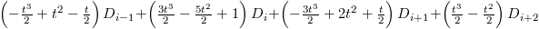

# The BitSquid low level animation system

In the BitSquid engine we differ between the low level and the high level animation system. The low level system has a simple task: given animation data, find the bone poses at a time t. The high level system is responsible for blending animations, state machines, IK, etc.

Evaluation of animation data is a memory intensive task, so to maximize performance means:

* Touch as little memory as possible (i.e., compress the animations as much as possible)

* Touch memory in a cache friendly way (i.e., linearly)

In the BitSquid engine we do animation compression by curve fitting and data quantization.

There are a lot of different possible ways to do curve fitting. Since we are curve fitting for compression it doesn't really matter what method we use as long as (a) we can keep the error below a specified threshold, (b) the curve representation is small (good compression rate), (c) the curve is reasonably smooth and (d) it does not take too long to evaluate.

In the BitSquid engine we currently use a hermite spline with implicitly computed derivatives. I.e., we represent the curve with time and data points: (t_1, D_1), (t_2, D_2), ..., (t_n, D_n) and evaluate the curve at the time T in the interval t_i ... t_i+1, with t = (T - t_i) / (t_i+1 - t_i) by

This formulation gives pretty good compression rates, but I haven't investigate all the possible alternatives (there are a lot!). It is possible that you could achieve better rates with some other curve. An advantage of this formulation is that it only uses the original data points of the curve and scaling constants in the range 0-1, which makes it easy to understand  the effects of quantization.

To do the curve fitting we just check the error in all curve intervals, find the interval D_i D_i+1 with the largest error and split it in half by introducing a new data point at (t_i + t_i+1)/2. We repeat this until the error in all intervals is below a specified threshold value. Again, it is possible that more careful selection of split points could give slightly better compression rates, but we haven't bothered. Note also that we can support curve discontinuities by just inserting two different data points for the same time point.

Animation compression can be done either in local space or in global space. The advantage of keeping the animations in global space is that there is no error propagation through the bone hierarchy, which means that you can use larger error thresholds when compressing the animations. On the other hand, the movement of a bone in global space is typically more complicated. (For a closed fist on a moving arm, the fingers will have no movement in local space, but a lot of movement in global space.) Since a more complicated movement is harder to compress, it might be that the global representation is more expensive, even though you can use a higher threshold. (I haven't actually tried this and compared - so much to do, so little time.)

Also, if you are going to do any animation blending you will probably want to translate back to local space anyhow (unless you blend in global space). For this reason, the BitSquid engine does the compression in local space.

For Vector3 quantization we use 16 bits per component and the range -10 m to 10 m which gives a resolution of 0.3 mm.

For quaternions we use 2 bits to store the index of the largest component, then 10 bits each to store the value of the remaining three components. We use the knowledge that 1 = x^2 + y^2 + z^2 + w^2 to restore the largest component, so we don't actually have to store its value. Since we don't store the largest component we know that the remaining ones must be in the range (-1/sqrt(2), 1/sqrt(2)) (otherwise, one of them would be largest). So we use the 10 bits to quantize a value in that range, giving us a precision of 0.0014.

So, to summarize, that gives us 48 bits per Vector3 curve point and 32 bits per quaternion curve point, plus 16 bits for the time stamp. Now the only thing remaining is to package all these curve points for all the bones in a cache friendly way. This will be the topic of another blog post, since this one is already long enough.
