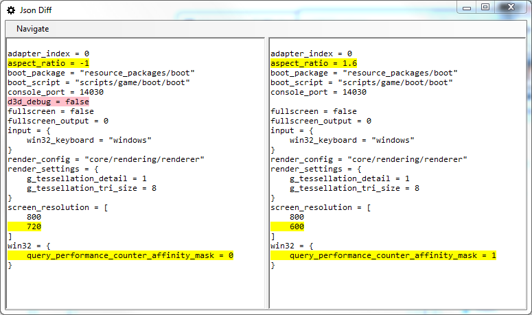

# BitBucket for BitSquid

I have made some improvements to the Json Merge tool. It can now display diffs and merges visually:

To make the distribution of our public tools easier I've uploaded them as bitbucket repositories. You can find them at:

http://bitbucket.org/bitsquid/

Currently their are three projects available, our Json Merger, our Distance Field Font Generator and our Motion Builder Exporter.