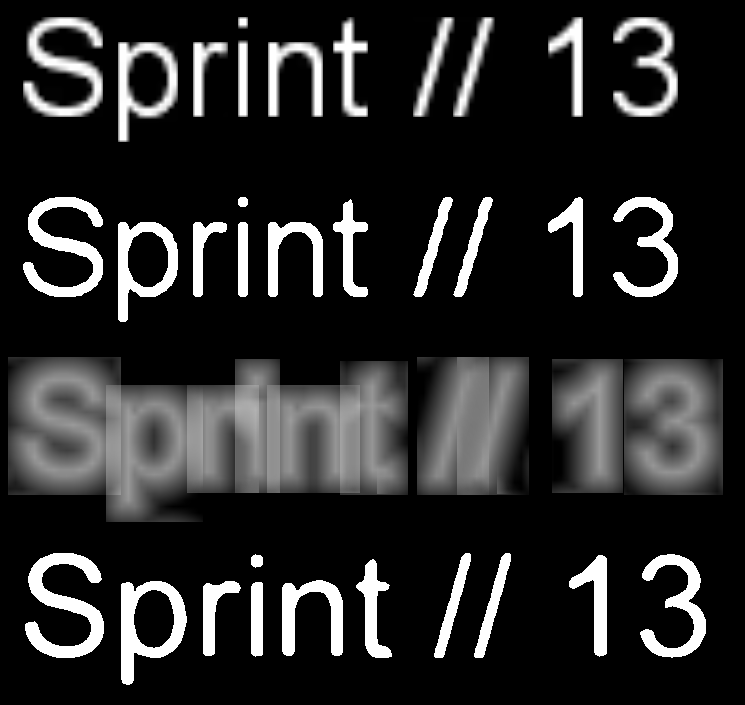
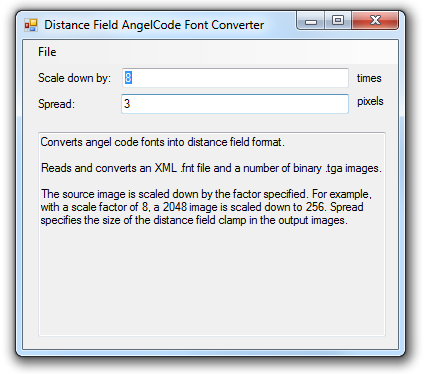

# Distance Field Based Rendering of AngelCode Fonts

This morning, we added support for distance field based font rendering to the BitSquid engine (from Valve's paper http://www.valvesoftware.com/publications/2007/SIGGRAPH2007_AlphaTestedMagnification.pdf). An example is shown below:

The top row shows the original font, below that is the original font rendered with alpha test. The third row is a distance field representation of the font and the final row shows the distance field representation rendered with alpha test. Note that the distance field version gives better quality in the diagonal lines.

(Note: The last row looks thicker than the second row, because it was generated from a large font size and scaled down, while the second row was generated from a small font size. Because of true type font hinting at small sizes, the result is different. The last row gives a truer representation of the "actual" thickness of the font.)

A quick Google search didn't show any good tools for generating distance field font maps, so I decided to write my own. We use the excellent AngelCode Bitmap Font Generator (http://www.angelcode.com/products/bmfont/) to generate our font maps, so I decided to make a tool that works with the files generated by AngelCode:

The tool takes a high resolution AngelCode *.fnt* file as input. It scales it down by the specified scale factor and converts it to a distance field. The spread specifies how many pixels the distance field should extend outside the character outline before it clamps to zero. (It is useful if you want to add things such as glow effects to the font rendering.) After the conversion, the tool outputs new scaled down .tga images of the fonts and a new *.fnt* file with all measurements converted to work with the scaled down textures.

So to use it, you first generate a font bitmap and *.fnt* file using AngelCode at 8 x the font size and 8 x the texture size you want in the final image. (Make sure to add *8 x spread* pixels of padding around the characters or else the distance fields will bleed into each other.) Then you run the tool to convert it to a distance field texture.

The tool is a bit limited -- it only works with monochrome uncompressed *.tga* files. It only reads and writes the XML version of the AngelCode font format. The distance field generation isn't particularly clever or fast. But I thought I should share it anyway since I couldn't find any other tools for generating distance field based font maps. Modifying it to support more formats shouldn't be much work.

Grab a binary version here:

* [distance_field.exe.7z](http://www.bitsquid.se/files/distance_field.exe.7z)

Or the C# project files here:

* [distance_field.7z](http://www.bitsquid.se/files/distance_field.7z)

Feel free to do whatever you want with it!