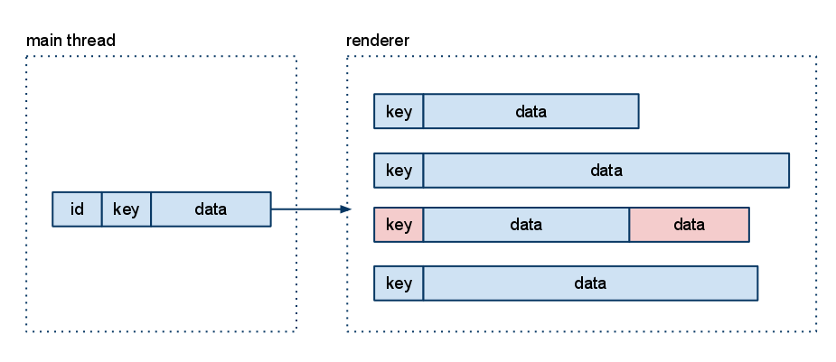

# BitSquid's Dual Mode GUIs

The BitSquid engine uses a dual mode GUI system. That is, the GUI system can be run both in retained and immediate mode. For GUIs with lots of static data, retained mode can be used for increased efficiency. For smaller or more dynamic GUIs it is simpler to work in immediate mode.

The retained mode and the immediate mode use the same API and the same implementation with just a simple flag that controls the mode. To see how that is possible, it is easiest to begin by looking at how our GUIs are rendered.

Despite their simplicity, ordinary 2D GUIs can be quite taxing to a renderer. The reason is that they often contain many small individual objects. You can easily have a GUI with 500 little icons, text strings, radar blips, etc. If you render them as individual objects your batch count will go through the roof. The key to efficient GUI rendering is thus to batch together similar objects into larger buffers to get fewer draw calls.

In the BitSquid engine, the GUI batching works like this: When the main thread wants to render a GUI object it generates three pieces of data and sends them to the renderer.

* An *id* that uniquely identifies the object.

* A *batch key* consisting of *(gui layer, material)*. Objects in the same layer with the same material can be batched together.

* The *vertex data* (positions, normals, vertex colors, uv-coordinates) for the object to be rendered.

The renderer finds an existing batch with a matching *batch* key and appends the vertex data to the vertex buffer of that batch. If no matching batch exists a new batch is created.



When it is time to render, the renderer just renders all its batches with their corresponding data.

The main thread can modify an object by resending the same id with a new batch key and new vertex data. The renderer will delete the old data from the batch buffers and insert the new data. The main thread can also send an id to the renderer and request the object to be deleted. The renderer will delete the object's vertex data from the batch buffers.

To higher level systems, the GUI exposes an interface that looks something like this:

```lua
create_text(pos, text, font, color) : id
update_text(id, pos, text, font, color)
destroy_text(id)
```

*create_text()* creates a new id, generates the vertex data for the text object and sends it to the renderer. *update_text()* generates new vertex data and sends it to the renderer to replace the old data. *destroy_text()* tells the renderer to delete the vertex data corresponding to the object.

What is interesting about this API is that there are no separate *move()*, *set_text()*, *set_font()* and *set_color()* functions. If you want to change the text object, you have to provide all the necessary data to the *update_text()* function. This means that *update_text()* has all the data required to generate the object's data from scratch, so we don't have to retain any information about the objects in the main thread. The only data that is retained anywhere are the batch vertex buffers kept by the renderer. In this way we save memory, reduce the number of functions in the API and make the implementation a lot simpler. It also becomes easy to add new object types to the GUI, you just have to write a function that generates the batch key and the vertex data for the object.

You could argue that the API makes things more complicated for the user, since she now has to supply all the parameters to configure the text even if she just wants to change one of them (the color, for instance).  In my experience, that is usually not a problem. Typically, the user already has all the needed data stored somewhere and can just pass it to the *update()* function. For instance, the text to be displayed might be stored in a *player_name* variable. Retaining the data in the GUI would just mean that the data would be stored in two different places and add the burden of keeping them synchronized.

With all this in place, it is easy to see how we can support both retained mode and immediate mode in the same implementation.

In retained mode everything works as described above. The user calls *create()* to create an object, *update()* to modify it and *destroy()* to destroy it.

In immediate mode, only the create() function is used and the renderer is set to clear its batches every frame. Thus, any object drawn with *create()* will be drawn exactly one frame and then get cleared by the renderer.