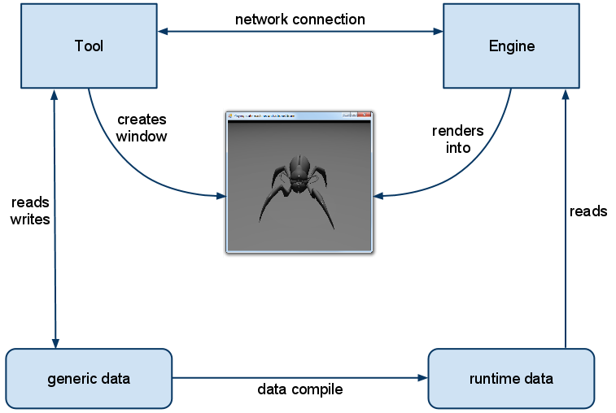

# Our Tool Architecture

The BitSquid tool architecture is based on two main design principles:

* Tools should use the "real" engine for visualization.

* Tools should not be directly linked or otherwise strongly coupled to the engine.

Using the real engine for visualization means that everything will look and behave exactly the same in the tools as it does in-game. It also saves us the work of having to write a completely separate "tool visualizer" as well as the nightmare of trying to keep it in sync with changes to the engine.

By decoupling the tools from the engine we achieve freedom and flexibility, both in the design of the tools and in the design of the engine. The tools can be written in any language (C#, Ruby, Java, Lisp, Lua, Python, C++, etc), using any methodology and design philosophy. The engine can be optimized and the runtime data formats changed without affecting the tools.

What we envision is a Unix-like environment with a plethora of special purpose tools (particle editor, animation editor, level editor, material editor, profiler, lua debugger, etc) rather than a single monolithic Mega-Editor. We want it to be easy for our licensees to supplement our standard tool set with their own in-house tools, custom written to fit the requirements of their particular games. For example, a top-down 2D game may have a custom written tile editor. Another programmer may want to hack together a simple batch script that drops a MIP-step from all vegetation textures.

At first glance, our two design goals may appear conflicting. How can we make our tools use the engine for all visualization without strongly coupling the tools to the engine? Our solution is shown in the image below:



Note that there is no direct linkage between the tool and the engine. The tool only talks to the engine through the network. All messages on the network connection are simple JSON structs, such as:

```json
{
    "type" : "message",
    "level" : "info",
    "system" : "D3DRenderDevice",
    "message" : "Resizing swap chain: 1626 1051"
}
```

This applies for all tools. When the lua debugger wants to set a breakpoint, it sends a message to the engine with the lua file and line number. When the breakpoint is hit, the engine sends a message back. (So you can easily swap in your own lua debugger integrated with your favorite editor, by simply receiving and sending these messages.) When the engine has gathered a bunch of profiling data, it sends a profiler message. Et cetera.

For visualization, the tool creates a window where it wants the engine to render and sends the window handle to the engine. The engine then creates a swap chain for that window and renders into it.

(In the future we may also add support for a VNC-like mode where we instead let the engine send the content of the frame buffer over the network. This would allow the tools to work directly against consoles, letting the artists see, directly in their editors, how everything will look on the lead platform.)

A tool typically boots the engine in a special mode where it runs a custom lua script designed to collaborate with that particular tool. For example, the particle editor boots the engine with *particle_editor_slave.lua* which sets up a default scene for viewing particle effects with a camera, skydome, lights, etc. The tool then sends script commands over the network connection that tells the engine what to do, for example to display a particular effect:

```json
{
    type = "script",
    script = "ParticleEditorSlave:test_effect('fx/grenade/explosion')"
}
```

These commands are handled by the slave script. The slave script can also send messages back if the tool is requesting information.

The slave scripts are usually quite simple. The particle editor slave script is just 120 lines of lua code.

To make the tools independent of the engine data formats we have separated the data into human-readable, extensible and backwards compatible *generic data* and fast, efficient, platform specific *runtime data*. The tools always work with the generic data, which is pretty much all in JSON (exceptions are textures and WAVs). Thus, they never need to care about how the engine represents its runtime data and the engine is free to change and optimize the runtime format however it likes.

When the tool has changed some data and wants to see the change in-engine, it launches the *data compiler* to generate the runtime data. (The data compiler is in fact just the regular Win32 engine started with a *-compile* flag, so the engine and the data compiler are always in sync. Any change of the runtime formats triggers a recompile.) The data compiler is clever about just compiling the data that has actually changed.

When the compile is done, the tool sends a network message to the engine, telling it to reload the changed data file at which point you will see the changes in-game. All this happens nearly instantaneously allowing very quick tweaking of content and gameplay (by reloading lua files).

This system has worked out really well for us. The decoupling has allowed for fast development of both the tools and the engine. Today we have about ten different tools that use this system and we have been able to make many optimizations to the engine and the runtime formats without affecting the tools or the generic data.