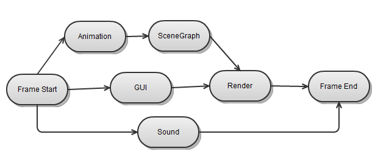
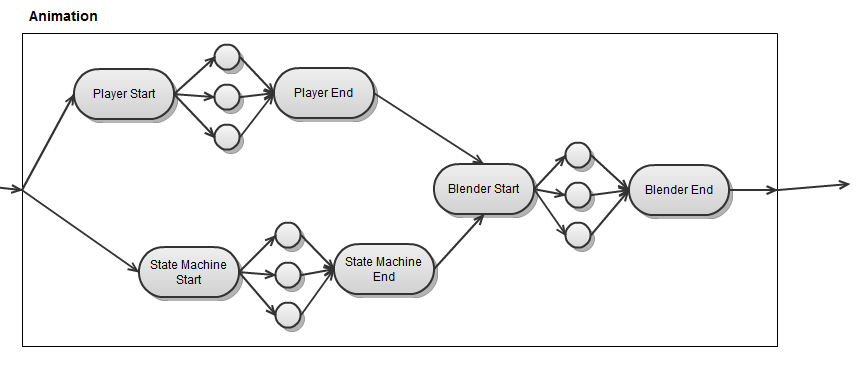
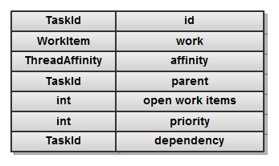
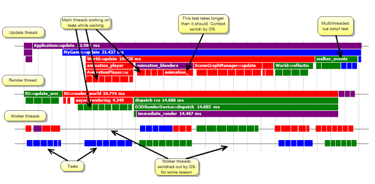

# Task Management -- A Practical Example

I've spent the last couple of days rewriting the task manager in the BitSquid engine. Task management is an important topic in our glorious multicore future, but it is hard to find good practical information about it. GDC was also a bit of a disappointment in this regard. So I thought I should share some of my thoughts and experiences.

The previous iteration of our task scheduler was based on Vista ThreadPools and mainly supported data parallelism. (Though we still had a degree of task parallelism from running two main threads -- an update thread and a render thread -- which both posted batches of jobs to the task manager.)

For the rewrite, I had a number of goals:

* Move away from Vista Thread Pools. We want complete control over our job threads.

* Minimize context switching. This is a guessing game on Windows, since the OS will do what the OS will do, but minimizing oversubscription of threads should help.

* Make a system that can run completely task based. I. e., everything in the system is run as a task and there are no explicit *wait()* calls. Instead the entire code flow is controlled by task dependencies. Such a design allows us to exploit all possibilities for parallelism in the code which leads to maximum core utilization.

* Still be "backwards compatible" with a system that uses one or more "main threads" that *wait()* for data parallel jobs to complete, so that we can move incrementally to a more and more task based code flow.

* Support tasks that run on external processors, such as SPUs or GPUs.

* Support hierarchical decomposition of tasks.

By hierarchical decomposition I mean that it should be possible to analyze the system in terms of tasks and subtasks. So that, at a higher level, we can regard the animation system as a single task that runs in parallel to other system tasks:



But then we can zoom in on the animation task and see that in fact is composed of a number of subtasks which in turn parallelize:



Hierarchical decomposition makes it possible to analyze systems and subsystems at different levels of abstraction rather than having to keep the entire task dependency graph in our heads. This is good because my head just isn't big enough.

A task in the new implementation is a simple data structure:



Here *work* is a work item to be performed on an SPU, CPU or GPU. *affinity* can be set for items that must be performed on particular threads.

*parent* specifies child/parent relationships between tasks. A task can have any number of children/subtasks. A task is considered completed when its work has been executed and all its children has completed. In practice this is implemented by the *open_work_items* counter. The counter is initially set to the number of child tasks + 1 (for the task's own work item). When a task completes, it reduces the *open_work_items* count of its parent and when that figure reaches zero, the parent work is completed.

I do not explicitly track completed task. Instead I keep a list of all open (i.e. not completed) tasks. Any task that is not in the open list is considered completed. Note that the open list is separate from the queue of work items that need to be performed. Items are removed from the queue when they are scheduled to a worker thread and removed from the open list when they have completed.

The *dependency* field specifies a task that the task depends on. The task is not allowed to start until its dependency task has completed. Note that a task can only have a single dependency. The reason for this is that I wanted the task structure to be a simple POD type and not include any arrays or other external memory references.

Having a single dependency is not a limitation, because if we want to depend on more than one task we can just introduce an anonymous task with no work item that has all the tasks we want to depend on as children. That task will complete when all its children has completed, so depending on that task gives us the wanted dependencies.

The *priority* field specfies the importance of the task. When several tasks are available, we will pick the one with the highest priority. I will discuss this a bit more in a minute.

The *Task Manager* has a number of threads for processing tasks. Some of these are "main threads" that are created by other parts of the system and registered with the thread manager (in our case, an update thread and a render thread). The rest are worker threads created internally by the task manager. The number of worker threads is:

> worker_thread_count = number_of_cores - main_thread_count

The total number of threads managed by the task manager thus equals the number of cores in the system, so we have no over- or undersubscription.

The worker threads are in a constant loop where they check the task manager for work items to perform. If a work item is available, they perform it and then notify the task manager of its completion. If no work items are available, they sleep and are woken by the task manager when new work items become available.

The main threads run their normal serial code path. As part of that code path, they can create tasks and subtasks that get queued with the task manager. They can also *wait()* for tasks to complete. When a thread waits for a task it doesn't go idle. Instead it loops and helps the task manager with completing tasks. Only when there are no more tasks in the queue does the thread sleep. It wakes up again when there are more tasks to perform or when the task it originally waited for has completed.

The main threads can also process tasks while waiting for other events by calling a special function in the task manager *do_work_while_waiting_for(Event &)*. For example, the update thread calls this to wait for the frame synchronization event from the render thread.

This means that all task manager threads are either running their serial code paths or processing jobs -- as long as there are jobs to perform and they don't get preempted by the OS. This means that as long as we have lots of jobs and few sync points we will achieve 100 % core utilization.

This approach also allows us to freely mix serial code with a completely task based approach. We can start out with a serial main loop (with data parallelization in the *update()* functions):

```cpp
void World::update()
{
  _animation->update()
  _scene_graph->update();
  _gui->update();
  render();
  _sound->update();
}
```

And gradually convert it to fully braided parallelism (this code corresponds to the task graph shown above):

```cpp
void World::update()
{
  TaskId animation = _tasks->add( animation_task(_animation) );
  TaskId scene_graph = _tasks->add( scene_graph_task(_scene_graph) );
  _tasks->depends_on(scene_graph, animation);
  TaskId gui = _tasks->add( gui_task(_gui) );
  
  TaskId gui_scene = _tasks->add_empty();
  _tasks->add_child(gui_scene, scene_graph);
  _tasks->add_child(gui_scene, gui);
  
  TaskId render = _tasks->add( render_task(this) );
  _tasks->depends_on(render, gui_scene);
  
  TaskId sound = _tasks->add( sound_update_task(_sound) );
  
  TaskId done = _tasks->add_empty();
  _tasks->add_child(done, render);
  _tasks->add_child(done, sound);
  
  _tasks->wait(done);
}
```

Note that tasks, subtasks and dependencies are created dynamically as part of the execution of serial code or other tasks. I believe this "immediate mode" approach is more flexible and easier to work with than some sort of "retained" or "static" task graph building.

A screenshot from our profiler shows this in action for a scene with 1000 animated characters with state machines:


Notice how the main and render threads help with processing tasks while they are waiting for tasks to be completed.

Once we have a task graph we want to make sure that our scheduler runs it as fast possible. Theoretically, we would do this by finding the critical path of the graph and making sure that tasks along the critical path are prioritized over other tasks. It's the classical task *scheduling problem*.

In a game, the critical path can vary a lot over different scenes. Some scenes are render bound, others are CPU bound. Of the CPU bound scenes, some may be bounded by script, others by animation, etc.

To achieve maximum performance in all situations we would have to dynamically determine the critical path and prioritize the tasks accordingly. This is certainly feasible, but I am a bit vary of dynamically reconfiguring the priorities in this way, because it makes the engine harder to profile, debug and reason about. Instead I have chosen a simpler solution for now. Each job is given a priority and the highest priority jobs are performed first. The priorities are not fixed by the engine but configured per-game to match its typical performance loads.

This seems like a resonable first approach. When we have more actual game performance data it would be interesting to compare this with the performance of a completely dynamic scheduler.

In the current implementation, all tasks are posted to and fetched from a global task queue. There are no per thread task queues and thus no task stealing. At our current level of task granularity (heavy jobs are split into a maximum of *5 x thread_count tasks*) the global task queue should not be a bottleneck. And a finer task granularity won't improve core utilization. When we start to have >32 cores the impact of the global queue may start to become significant, but until then I'd rather keep the system as simple as possible.

OS context switching still hits us occasionally in this system. For example one of the animation blending tasks in the profiler screenshot takes longer than it should:



I have an idea for minimizing the impact of such context switches that I may try out in the future. If a task is purely functional (idempotent) then it doesn't matter how many times we run the task. So if we detect a situation where a large part of the system is waiting for a task on the critical path (that has been switched out by the OS) we can allocate other threads to run the same task. As soon as any of the threads has completed the task we can continue.

I haven't implemented this because it complicates the model by introducing two different completion states for tasks. One where some thread has completed the task (and dependent jobs can run) and another where *all* threads that took on the task have completed it (and buffers allocated for the task can be freed). Also, context switching is mainly a problem on PC which isn't our most CPU constrained platform anyway.