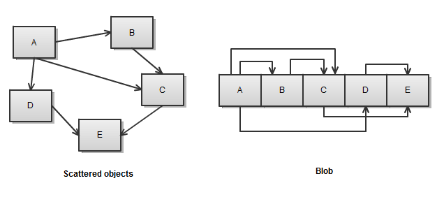
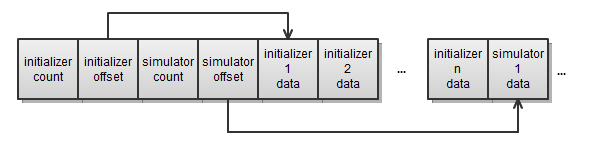

# The Blob and I

Having resource data in a single binary blob has many advantages over keeping it in a collection of scattered objects:



* *Shorter load times.* We can just stream the entire blob from disk to memory.
* *Cache friendly.* Related objects are at close locations in memory.
* *DMA friendly.* An entire blob can easily be transferred to a co-processor.

In past engines I've used placement new and pointer patching to initialize C++ objects from a loaded blob. To save a resource with this system all the objects are allocated after each other in memory, then their pointers are converted to local pointers (offsets from the start of the blob). Finally all the allocated data is written raw to disk.

When loading, first the raw data blob is loaded from disk. Then placement *new* is used with a special constructor to create the root object at the start of the blob. The constructor takes care of pointer-patching, converting the offsets back to pointers. Let's look at an example:

```cpp
class A
{
  int _x;
  B *_b;

public:
  A(int x, B *b) : _x(x), _b(b) {}
  A(char* base) {
    _b = (B*)( (char *)_b + (base - (char *)0) );
    new (_b) B(base);
  }
  ...
};
...
A *a = new (blob) A(blob);
```

Note that the constructor does not initialize *_x*. *a* is placement *new*:ed into an area that already contains an *A* object with the right value for *_x* (the saved value). By not initializing *_x* we make sure that it keeps its saved value. The constructor does three things:

* Initializes the vtable pointer of *a*. This is done "behind the scenes" by C++ when we call *new*. It is necessary for us to be able to use *a* as an *A* object, since the vtable pointer of *A* saved in the file during data compilation will typically not match the vtable pointer of *A* in the runtime.

* Pointer patches *_b*, converting it from an offset from the blob base to its actual memory location.

* Placement *new*:s *B* into place so that *B* also gets the correct vtable, patched pointers, etc. Of course *B*'s constructor may in turn create other objects.

Like many "clever" C++ constructs this solution gives a smug sense of satisfaction. Imagine that we are able to do this using our knowledge of vtables, placement *new*, etc. Truly, we are Gods that walk the earth!

Of course it doesn't stay this simple. For the solution to be complete it must also be able to handle base class pointers (call a different *new* based on the "real" derived class of the object, which must be stored somewhere), arrays and collection classes (we can't use *std::vector*, etc because they don't fit into our clever little scheme).

Lately, I've really come to dislike these kinds of C++ "framework" solutions that require that every single class in a project conform to a particular world view (implement a special constructor, a special save() function, etc). It tends to make the code very coupled and rigid. God forbid you ever had to change anything in the serialization system, because now the entire *WORLD* depends on it. The special little placement constructors creep in everywhere and pollute a lot of classes that don't really want to care about serialization. This makes the entire code base complicated and ugly.

Also, it should be noted that naively "blobbing" a collection of scattered objects by just concatenating them in memory does not necessarily lead to optimal memory access patterns. If the memory access order does not match the serialization order there can still be a lot of jumping around in memory. The serialization order with this kind of solution tends to be depth-first and can be tricky to change. (Since the entire *WORLD* depends on the serialization system!)

In the BitSquid engine I use a much simpler approach to resource blobs. The BitSquid engine is *data-centric* rather than class-centric. The data design is done first -- laid out in simple structs, optimized for the typical access patterns and DMA transfers. Then functions are defined that operate on the data. Classes are used to organize higher level systems, not in the low level processing intensive systems or resource definitions. Inheritance is very rarely used. (Virtual function calls are always cache unfriendly since they resolve to different code locations for each object. It is better to keep objects sorted by type and then you don't really need virtual calls.)

I believe this "old-school" C-like approach not only gives better performance, but also in many cases a better design. A looser coupling between data and processing makes it easier to modify things and move them around. And deep, bad inheritance structures are the main source of unnecessary coupling in C++ programs.

Since the resource data is just simple structs, not classes with virtual functions, we can just write it to disk and read it back as we please. We don't need to initialize any vtable pointers, so we don't need to call new on the data.

The problem with pointer patching is solved in the simplest way possible -- I don't use pointers in the resource data. Instead, I just use offsets all the time, both in memory and on disk. For example, the resource data for our particle systems looks something like this (simplified):



Yes, having offsets in the resource data instead of pointers means that I occasionally need to do a pointer add to find the memory location of an object. I'm sure someone will balk at this "unnecessary" computation, but I can't see it having any significant performance impact whatsoever. (If you have to do it a lot, then you are jumping around in memory a lot and then that is the main source of your performance problem.)

The advantage is that since I'm only storing offsets I don't need to do any pointer patching at all. I can move the data around in memory as I like, make copies of it, concatenate it to other blobs to make bigger blobs, save it to disk and read it back with a single operation and no need for pre- or post-processing. There is no complicated "serialization framework". No system in the engine needs to care about how any other system stores or reads it data.

As in many other cases the data-centric approach gives a solution that is simpler, faster, more flexible and more modular.