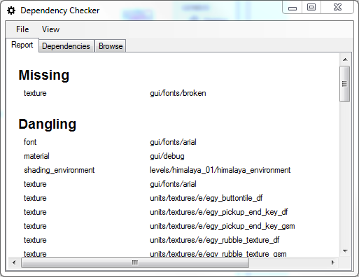
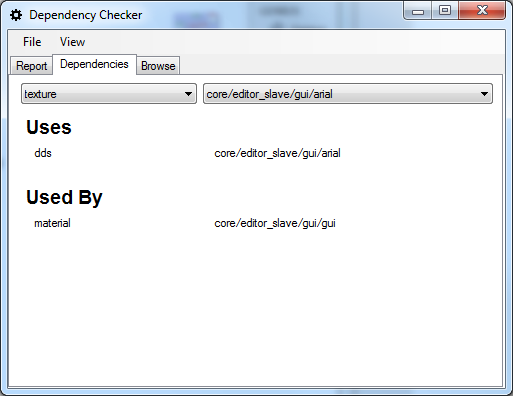
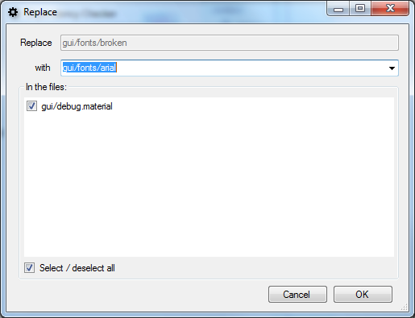
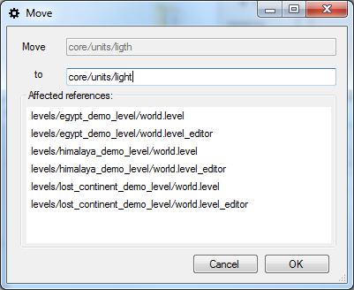
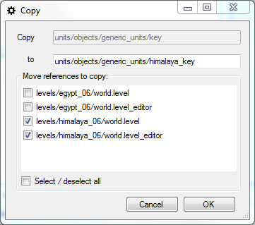

# The Dependency Checker

Maintaining referential integrity between resources in a big game project can be challenging:

* Someone might accidentally delete an entity that is used somewhere in a level.

* Someone might change a texture to improve the look of one object, without knowing that that texture is shared by two other objects.

* A resource may have a misspelled name, but no one dares change it, because it is used in too many places.

* There may be "dead" resources in the project, that aren't used anywhere, but no one knows how to find them, so that they can be deleted.

To help with these issues, I've created a new tool for the BitSquid tool chain, the *Dependency Checker*. The Dependency Checker understands all BitSquid file formats and knows how they can refer to other resources. By parsing the source tree it is thus able to create the complete dependency graph of a project.

This isn't as complicated as it sounds, because we don't have that many different file formats, they are all based on SJSON and they use a standardized way of referring to other resources (type, name). The entire code for parsing and understanding all the different file formats is just 500 lines long.

Once we have the dependency graph, we can do lots of interesting things with it. The first is to find all missing and dangling resources:

Missing resources are resources that are referred somewhere, but that don't actually exist in the source tree. Dangling resources are existing resources that aren't referred anywhere.

We can click on any resource in the list (or any other resource in the project) to see its dependencies.

But the real interesting thing is the ability to patch dependencies. The Dependency Checker does not only know how to parse dependencies, it also knows how to modify them. (Yes, that is included in the 500 lines of code.) That means that it can replace, move and copy resources.

For example, we can replace the missing font texture with something else.

All files that used the font texture will be patched up to refer to the new resource.

*Move* is useful when we have given something a bad name and just want to clean up our resources a bit:

Copy can be used to quickly clone resources. But since the dependency checker lets you decide which (if any) references you want to redirect to the new copy, it can also be used as a quick way of splitting resources. For example if you decide that you want to use a different key entity on the *himalaya* level, you can make a copy of the key entity for just those levels.

