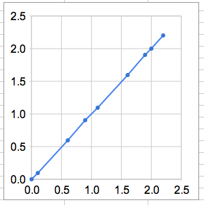
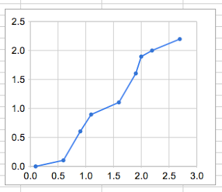
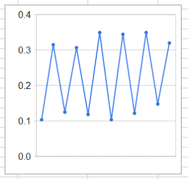
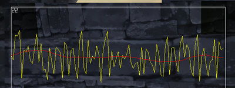

# Time Step Smoothing

Today I'm going to argue for smoothing your update delta time, i.e. to apply a simple low pass filter to it before using it to update the game state:

```
float dt = elapsed_time();
dt = filter(dt);
update_game(dt);
```

This assumes of course that you are using a variable time step. A fixed time step is always constant and doesn't need smoothing. 

Some people will say that you should always use a fixed time step, and there is a lot of merit to that. A stable frame rate always looks better and with a fixed time step the gameplay code behaves more deterministically and is easier to test. You can avoid a whole class of bugs that "only appear when the frame rate drops below 20 Hz". 

But there are situations where using a fixed frame rate might not be possible. For example if your game is dynamic and player driven, the player can always create situations when it will drop below 30 fps (for example, by gathering all the physics objects in the same place or aggroing all the enemies on the level). If you are using a fixed time step, this will force the game into slow motion, which may not be acceptable. 

On the PC you have to deal with a wide range of hardware. From the über-gamer that wants her million dollar rig to run the game in 250 fps (even though the monitor only refreshes at 90 Hz) to the poor min spec user who hopes that he can at least get the game to boot and chug along at 15 fps. It is hard to satisfy both customers without using a variable time step. 

The BitSquid engine does not dictate a time step policy, that is entirely up to the game. You can use fixed, variable, smoothed or whatever else fits your game. 

So, why am I arguing for smoothing variable time steps? A basic update loop without time smoothing looks something like this: 

```cpp
float dt = elapsed_time();
update_game(dt);
```

Each frame, we measure the time that has elapsed and use that to advance the game timer. 

This seems straight forward enough. Every frame we advance the game clock by the time that has elapsed since the last frame. Even if the time step oscillates you would expect this to result in objects moving in a smooth and natural manner: 



Here the dots represents the times (x-axis) at which we sample an object's position (y-axis). As you can see the samples result in a straight line for objects moving at a constant velocity, even though the time steps vary. All seems well. 

Except this graph doesn't tell the entire truth. The time shown in this graph is the time when we start simulating a frame, not when that frame is drawn on screen. For each frame we simulate, there is an amount of latency from the point when we start simulating the frame until it is drawn. In fact, the variation in that latency is what accounts for the varying elapsed times that we measure. (Well not entirely, there can be GPU latency that doesn't show up in the delta time, but for the sake of simplicity, let's assume that the latency of the current frame is the delta time we measure in the next frame.) 

If the take the latency into account and offset each time value in the graph above with the latency (the elapsed time of the next frame), we get a truer representation of what the player actually sees in the game: 



Oops, the line is no longer straight and there is a good chance that the user will notice this as jerky motion. 

If we could predict perfectly what the latency of the next frame would be, we could use that rather than the elapsed time of the last frame to advance our timers. This would compensate perfectly for the latency and the user would again see a straight line.

Unfortunately, perfectly predicting how long the next frame will take to simulate and render is impossible. But we can make a guess and that is one of the goals of our time step filter:

* To make a better guess of how long it will take to update and draw the next frame.

When we are using the standard update loop, we are guessing that the next frame will take as long to draw as the current frame. This is a decent guess, but we can do better. For example, if we calculate the mean delta time of the last few frames and use that instead, we can reduce the average error by about 30 %. (Says my quick and dirty guesstimate calculation. If you want a real figure you have to presume a delta time probability distribution and do the math. Because I'm too lazy to.) 

Here is the same graph again, but here we have smoothed the time step that we use to evaluate the object's position. 


As you can see, we get a straighter line than we got by using the "raw" variable time steps. 

Can we do anything to improve the prediction even further? Yes, if we know more about the data we are predicting. For example, on the PC, you can get occasional "glitch" frames with very long update times if you get interrupted by other processes. If you are using a straight mean, any time you encounter such a glitch frame you will predict that the next few frames will also take very long to update. But the glitch frame was an anomaly. You will get a better predictor by ignoring such outliers when you calculate the mean. 

Another pattern in the frame rate that is quite common is a zig-zag pattern where the game oscillates between two different frame rates: 



You could make a predictor for this. The predictor could detect if there is a strong correlation between the delta times for even and odd frames and if so, it could use only the even/odd frames to calculate the mean. 

But I don't recommend doing that. For two reasons. First, the zig-zag pattern is usually a result of a bad setup in the engine (or, if you are unfortunate, in the driver). It is better to fix that problem and get rid of the oscillations than to work around them. Second, heavily oscillating time steps, which you would get if you tried to follow the zig-zag pattern, tend to make gameplay code behave badly. 

So this gives us a second goal of time step filtering:

* Keep the time step reasonably stable from frame to frame.

Why do I say that oscillating time steps make gameplay code behave badly? Certainly, at any good studio, the gameplay code is written to be time step independent. Whenever an object is moved, the length of the time step is taken into account, so that it moves with the same speed regardless of the frame rate: 

```
s = s + v*dt
```

Yes, it is easy to make the update code for a single object frame rate independent in this manner. But once you start to have complex interactions between multiple objects, it gets a lot more difficult. 

An example: Suppose you want a camera to follow behind a moving object, but you don't want it to be completely stiff, you want some smoothness to it, like maybe lerping it to the right position, or using a dampened spring. Now try to write that in a completely time step independent manner. I.e., an oscillation in the time step should not cause the camera to oscillate with respect to the object it is following. 

Not so easy.

Game play code faces many similar issues. With 20+ game play programmers banging a way at the code base you can be quite certain that there are several places where oscillations in the time step lead to badly looking oscillating visuals in the game. And the best way to prevent that, in my opinion, is to smooth the time step so that it doesn't oscillate. 

In summary, this is our default method for time step smoothing in the BitSquid engine (though as I said above, you are of course free to use whatever time step you want):

* Keep a history of the time step for the last 11 frames.
* Throw away the outliers, the two highest and the two lowest values.
* Calculate the mean of the remaining 7 values.
* Lerp from the time step for the last frame to the calculated mean (adding more smoothness)

Here is an example of the filter in action. The yellow line in this graph shows the raw time step. The red line is the smoothed time step.



One last thing to mention. This calculation can cause your game clock to drift from the world clock. If you need them to be synchronized (for network play for example) you need to keep track of your "time debt" -- i.e., how far your clock has drifted from the world clock and "pay off" that debt over a number of frames by increasing or decreasing your time step, until you are back at a synchronized state.