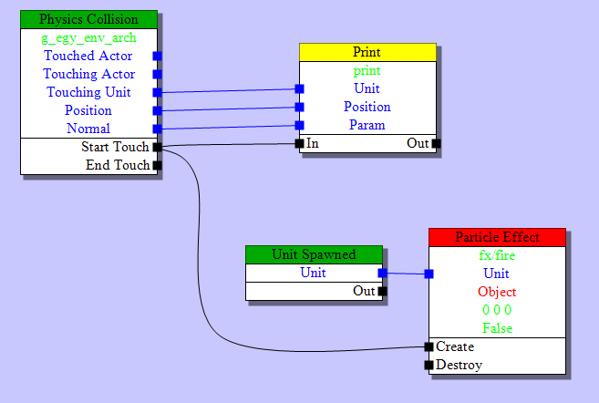

# Visual Scripting the Data-Oriented Way

The BitSquid engine has two separate scripting systems. The first is Lua. The entire engine is exposed to Lua in such a way that you can (and are encouraged to) write an entire game in Lua without touching the C++ code at all.

The second system, which is the focus of this post, is a visual scripting system that allows artists to add behaviors to levels and entities. We call this system *Flow*.

Lua and Flow have different roles and complement each other. Lua allows gameplay programmers to quickly test designs and iterate over gameplay mechanics. Flow lets artists enrich their objects by adding effects, destruction sequences, interactivity, etc. When the artists can do this themselves, without the help of a programmer, they can iterate much faster and the quality is raised.

Flow uses a pretty standard setup with nodes representing actions and events.  Black links control how events cascade through the graph causing actions to be taken. Blue links represent variables that are fed into the flow nodes:

In this graph, the green nodes represent events and the red node represents an action. The yellow node is an action implemented in Lua. The gameplay programmers can set up such actions on a per-project basis and make them available to the artists.

Each unit (= entity) type can have its own flow graph, specifying that unit's behavior, e.g. an explosion sequence for a barrel. There is also a separate flow graph for the entire level that the level designers can use to set up the level logic.

Since *Flow* will be used a lot I wanted to implement it as efficiently as possible, both in terms of memory and performance. This means that I don't use a standard object-oriented design where each node is a separate heap-allocated object that inherits from an abstract *Node* class with a virtual *do_action()* method. That way lies heap allocation and pointer chasing madness.

Sure, we might use such a design in the *editor*, where we don't care about performance and where the representation needs to be easy to use, modifiable, stable to version changes, etc. In the *runtime*, where the graph is static and compiled for a particular platform, we can do a lot better.

(This is why you should keep your editor (source) data format completely separate from your in-game data format. They have very different requirements. One needs to be dynamic, multi-platform and able to handle file format version changes. The other is static, compiled for a specific platform and does not have to care about versioning -- since we can just recompile from source if we change the format. If you don't already -- just use JSON for all your source data, and binary blobs for your in-game data, it's the only sane option.)

The runtime data doesn't even have to be a graph at all. There are at least two other options:

* We could convert the entire graph into a Lua program, representing the nodes as little snippets or functions of Lua code. This would be a very flexible approach that would be easy to extend. However, I don't like it because it would introduce significant overhead in both CPU and memory usage.

* We could "unroll" the graph. For each possible external input event we could trace how it flows through the graph and generate a list of triggered actions as a sort of "bytecode". The runtime data would then just be a bytecode snippet for each external event. This has the potential of being very fast but can be complicated by nodes with state that may cause branching or looping. Also, it could potentially use a lot of extra memory if there are many shared code paths.

So I've decided to use a graph. But not a stupid object-oriented graph. A data-oriented graph, where we put the entire graph in a single blob of cohesive memory:

Oh, these blobs, how I love them. They are really not that complicated. I just concatenate all the node data into a single memory chunk. The data for each node begins with a node type identifier that lets me *switch* on the node type and do the appropriate action for each node. (Yes, I'll take that over your virtual calls any day.) Pointers to nodes are stored as offsets within the blob. To follow a pointer, just add the offset to the blob's start address, cast the pointer to something useful and presto!

Yes, it is ok to cast pointers. You can do it. You don't have to feel bad about it. You know that there is a *struct ParticleEffectNode* at that address. Just cast the pointer and get it over with.

The many nice things about blobs with offsets deserve to be repeated:

* We can allocate the entire structure with a single memory allocation. Efficient! And we know exactly how much memory it will use.

* We can make mem-copies of the blob without having to do any pointer patching, because there are no pointers, only offsets.

* We can even DMA these copies over to a SPU. Everything is still valid.

* We can write the data to disk and read it back with a single call. No pointer patching or other fixups needed.

In fact, doesn't this whole blob thing look suspicously like a file format? Yes! That is exactly what it is. A file format for memory. And it shouldn't be surprising. The speed difference between RAM and CPU means that memory is the new disk!

If you are unsure about how to do data-oriented design, thinking "file formats for memory" is not a bad place to start.

Note that there is a separate blob for dynamic data. It is used for the nodes' state data, such as which actor collided with us for a collision event (the blue data fields in the flow graph). We build that blob in the same way. When we compile the graph, any node that needs dynamic data reserves a little space in the dynamic blob and stores the offset to that space from the start of the dynamic block.

When we clone a new entity, we allocate a new dynamic data block and memcopy in the template data from the dynamic data block that is stored in the compiled file.

Sharing of dynamic data (the blue links in the graph) is implemented by just letting nodes point to the same offset in the dynamic data blob.

Since we are discussing performance, I should perhaps also say something about multithreading. How do we parallelize the execution of flow graphs?

The short answer: we don't.

The flow graph is a high level system that talks to a lot of other high level systems. A flow graph may trigger an effect, play a sound, start an animation, disable a light, etc, etc. At the same time there isn't really any heavy CPU processing going on in the flow graph itself. In fact it doesn't really do anything other than calling out to other systems. Multithreading this wouldn't gain a lot (since the compute cost is low to begin with) and add significant costs (since all the external calls would have to be synchronized in some way).