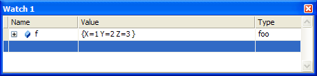
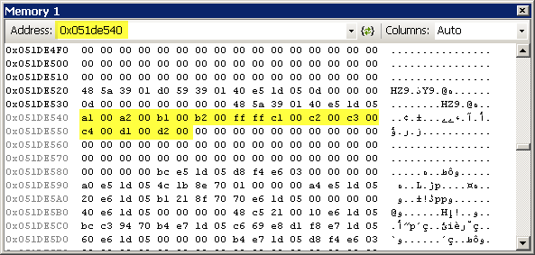
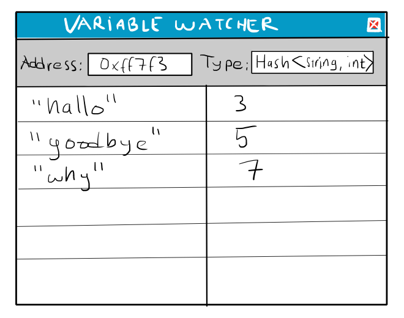
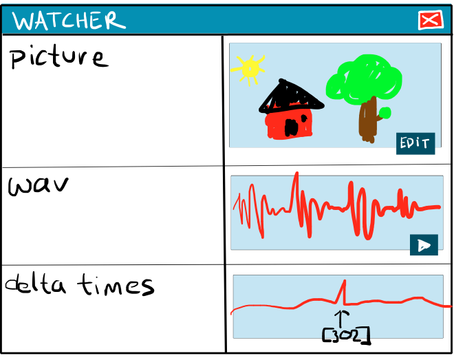

# An idea for better watch windows

Watch windows suck. I’ve spent a large part of my career looking at them (that’s how those bugs get fixed) and it’s often a frustrating experience.



Visual Studio’s watch window is one of the better ones, but it still has many issues that make the debugging experience a lot less pleasant than it could be.

* Custom data types such as *MyTree*, *MyHashSet* and *MyLinkedList* are difficult to look at. To get to the content you have to understand the internal data layout and expand the links by hand.

* I like to pack my resource data into [tight static blobs](http://bitsquid.blogspot.com/2010/02/blob-and-i.html) -- *file formats for memory*. A simple such blob might have a header with a variable number of offsets into a buffer of tightly packed strings. Such memory layouts cannot be described with just C structs and the watch window can’t inspect them. You have to cast pointers by hand or use the *Memory* view.



*I don’t even see the code. All I see is a hermite curve fitted, time key sorted, zlib compressed reload animation.*

* If I have an array with 10 000 floats and one of them is a #NaN, I have no way of finding out except to expand it and scroll through the numbers until I find the bad one.

* The watch window can’t do reverse lookup of string hashes, so when I see a hash value in the data I have no idea what it refers to.

Yes, I know that some of these things can be fixed. I know that you can get the Visual Studio Debugger to understand your own data types by editing *autoexp.dat*. And since I’ve done that for all our major collection types (*Vector*, *Deque*, *Map*, *SortMap*, *HashMap*, *Set*, *SortSet*, *HashSet*, *ConstConfigValue* and *DynamicConfigValue*) I know what a pain it is, and I know I don’t want to do it any more. Also, it doesn’t help the debuggers for the other platforms.

I also know that you can do some tricks with Visual Studio extensions. At my previous company we had reverse hash lookup through a Visual Studio extension. That was also painful to write, and a single platform solution.

So yes, you can fix some things and will make your work environment a little better. But I think we should aim higher.

Consider this: The variable watcher has access to the entire game memory and plenty of time to analyze it. (Variable watching is not a time critical task.)

Imagine what a well written C program that knew the layout of all your data structures could do with that information. It could expand binary trees and display them in a nice view, reverse lookup your hashes, highlight uninitialized *0xdeadbeef* variables, spell check your strings, etc.

## The idea

So this is my idea: instead of writing plug-ins and extensions for all the IDEs and platforms in the world, we write the watcher as a separate external program. The user starts the program, connects to a process, enters a memory address and a variable type and gets presented with a nice view of the data:



The connection backend would be customizable so that we could use it both for local processes and remote devices (Xbox/PS3). The front end sends an (address, size) request and the backend replies with a bunch of data. So the platform doesn’t matter. As long as there is some way of accessing the memory of the device we can connect it to the watcher.

We can even use it to look at file contents. All we need is a backend that can return data from different offsets in the file. This works especially well for [data blobs](http://bitsquid.blogspot.com/2010/02/blob-and-i.html), where the file and memory formats are identical. The watcher would function as a general data viewer that could be used for both files and memory.

For this to work, we need a way to describe our data structures to the program. It should understand regular C structs, of course, but we also need some way of describing more complex data, such as variable length objects, offsets, choices, etc. Essentially, what we need is a generic way to describe blobs of structured data, no matter what the format and layout.

I’m not sure what such a description language might look like (or if one already exists), but it might be something loosely based on C structs and then extended to cover more cases. Perhaps something like:

```cpp
struct Data
{
	zero_terminated char[] name;
	pad_to_4_bytes_alignment;
	platform_endian unsigned count;
	Entry entries[count];
};
```

The program also needs an extension mechanism so that we can write custom code for processing objects that can’t be described using even this more advanced syntax. This could be used for things like reverse hash lookups, or other queries that depend on external data.

Going further the program could be extended with more visualizers that could allow you to view and edit complex objects in lots of interesting ways:




I think this could be a really useful tool, both for debugging and for inspecting files (as a sort of beefed up hex editor). All I need is some time to write it.

What do you think?
