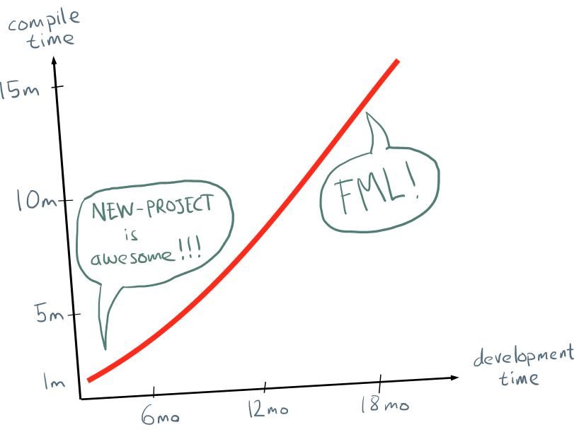
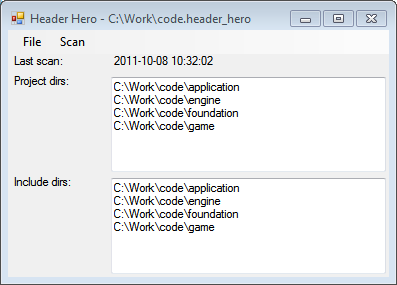
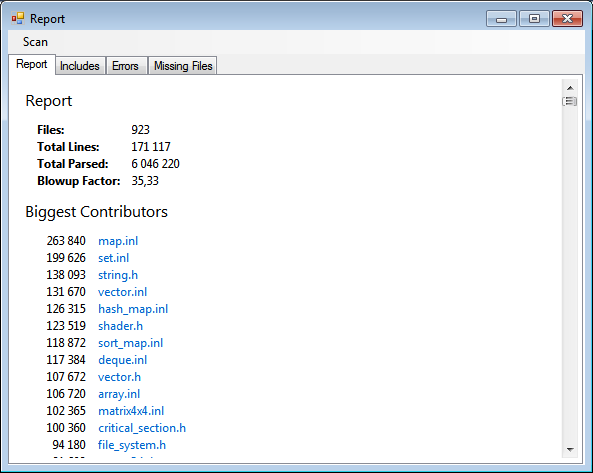
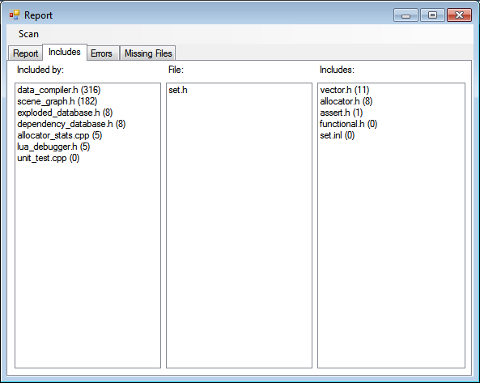
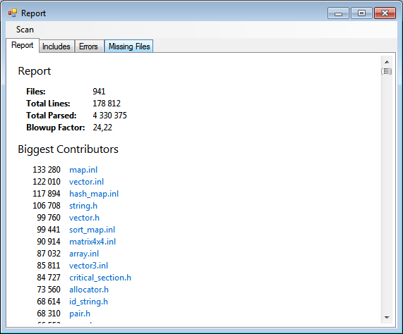

# Caring by Sharing: Header Hero



Compile times get worse over time, that is the second law of C++ programming dynamics. There are many small day-to-day changes that each exacerbate the problem slightly: The project grows. New header files get included. Clever templates get written. And so on. There are comparatively few forces that work in the other direction. Once an `#include` has been added, it stays.

The only exception is when some hero steps up, says *Enough!* and starts to crunch down on those header files. It is thankless menial work that offers few rewards, save the knowledge that you are contributing to the public good.

Today, I want to give something back to these unsung heroes, so I’ve made a small tool to make their drudgery a bit less... drudgery-ish? It is called *Header Hero*:



To run *Header Hero* you specify the directories where your *.cpp* files can be found as well as the directories to search for included headers. The program scans your *.h* and *.cpp* files to find all the include links. It presents the result in a summarized report that shows you what the worst headers are. You can think of it as a header file profiler.

You don’t need to specify all your include directories, but only the ones you have specified will be scanned.

I’ve focused on making the tool fast by caching as much information as possible and using a simple parser that just looks for `#include` patterns rather than running the real C preprocessor. The downside is that if you are using any fancy preprocessor tricks, they will most likely be missed. On the other hand, the tool can scan a huge project in seconds. And after the initial scan, new scans can be done in a fraction of that time.

The program produces a report that looks something like this:



At the top are some statistics, such as the total number of files and lines in the project. *Total Parsed* counts how many lines that would actually be parsed in a full recompile of the project. So, a header that is included by several *.cpp* files adds to that number every time. The *Blowup Factor* are the last two items divided. It specifies how many times, on average, each line gets parsed. A value of 35 means that on average, each line in our project is parsed 35 times. That seems quite a lot.

Below the summary are a list of the header files sorted by how many lines they contributed to the *Total Parsed* number. In other words, the size of that file multiplied by the number of times it was included.

Looking at the sample report above, it seems pretty reasonable. At the top we find big templated collection classes (*map*, *set*, *string*, *vector*) that have big header files and are used in a lot of places. Math (*matrix4x4*, *vector3*) and utility (*critical_section*, *file_system*) files also end up high on the list.

But when you dig into it, there are also things that seem a bit fishy. `Set<T>` is not a very popular collection class. Sets are used less than maps, and `HashSet` is usually preferable to `Set`. Why does it end up so high on the list? What is `shader.h` doing there? That seems too specialized to end up so high. And `file_system.h`? There shouldn’t be that much code that directly accesses the file system, only the resource loader needs to do that.

To answer those questions, you can click on any file in the report to get a detailed view of its relations:



In the middle we find the file we are looking at. To the left are the files that directly include it. The number after each file name specifies how many files that directly or indirectly include *that* file. To the right are the files included by the file. The numbers are all the files directly or indirectly included by *those* files. You can double click on any file name in the view to refocus on it.

Here we clearly see that the main culprit is `data_compiler.h`. It includes `set.h` and is in turn included by 316 other files. To fix the compile times we can make `data_compiler.h` not include `set.h` or we can try to reduce the number of files that include `data_compiler.h` (that number also seems high). If we also fix `scene_graph.h` we can really make a difference.

Breaking dependencies is a whole topic in itself, especially when it comes to templates and inlined code. Here are some quick tips though:

1. Predeclare the structs and classes that you use instead of including the header file. Don’t forget that you can predeclare templates and typedefs as well as regular classes:

  ```cpp
  class MyClass;
  typedef int Id;
  template <class T> class Vector;
  ```

2. Predeclared types can only be used as pointers and references. You can’t have a member variable of a type whose actual size is unknown. So you may have to change your member variables to pointers in order to get rid of the header dependency. You can also use the [pimpl idiom](http://en.wikipedia.org/wiki/Opaque_pointer), if you can live with the extra indirection and lack of inlining.

3. Switching from in-place variables to pointers can lead to bad memory access patterns. One way of fixing that is to placement new the object directly into a raw memory buffer.

  ```cpp
  // a.h

  class B;

  class A {
      A();
      B *_b;
      static const int SIZE_OF_B = 20;
      char _b_storage[SIZE_OF_B];
  };
  
  // a.cpp
  
  #include ”b.h”
  
  A::A()
  {
      XASSERT(sizeof(B) == SIZE_OF_B);
      _b = new (_b_storage) B();
  }
  ```

  With this technique, you get the data for *B* stored inside *A*, without having to include the `b.h` header in `a.h`. But the code isn’t exactly easy to read, so you should only use this in desperate situations.

4. For files with small type definitions, but lots of inlined methods (e.g., `matrix4x4.h`), a good strategy is to split the file, so you have just the type in one file and all the methods in the other. Header files can then include just the type definition, while *.cpp* files pull in the whole shebang.

Using these techniques you can get rid of the header dependencies one by one, until you are back at reasonable compile times. Since a rescan takes just a fraction of a second it is easy to see how your changes affect the compile time. Just make sure you have your integration test running, it is easy to break build configurations when you are fiddling around with the headers.

Here is the result of about a day and a half of header optimization in our code base:



From 6 million to 4.3 million lines, that’s not too shabby. We can now do a complete rebuild in 37 seconds on a reasonably modern machine. With this tool we can hopefully keep that number.

You can download the C# source code here. Feel free to do whatever you like with it:

* https://bitbucket.org/bitsquid/header_hero