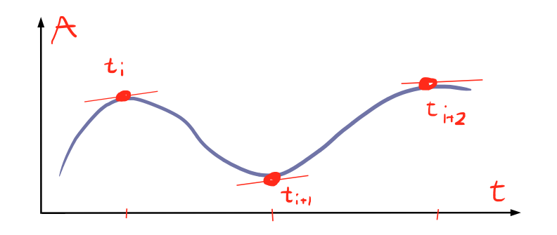
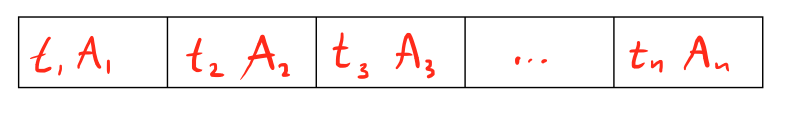
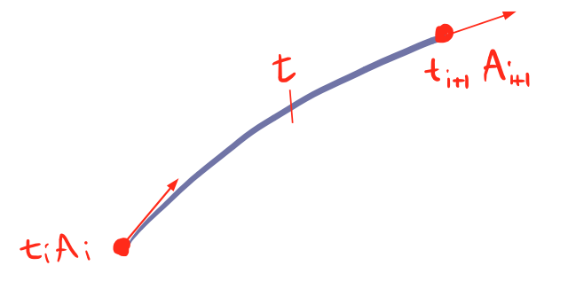
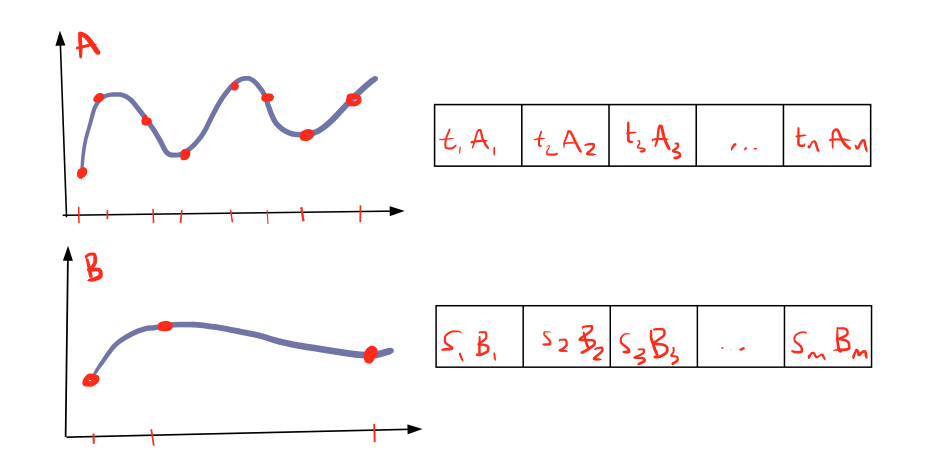
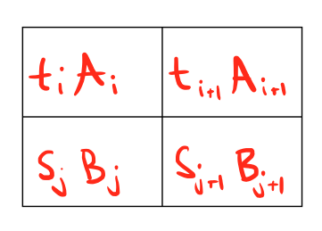
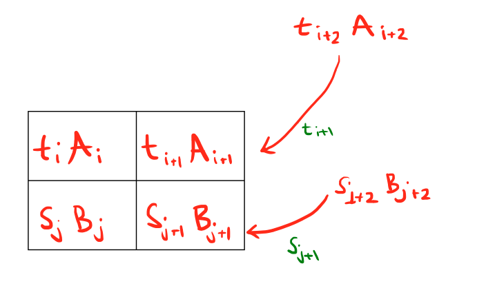
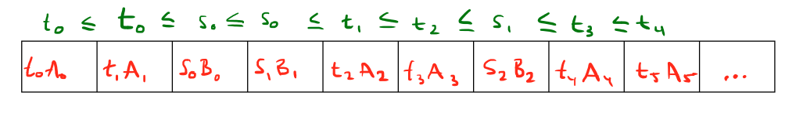
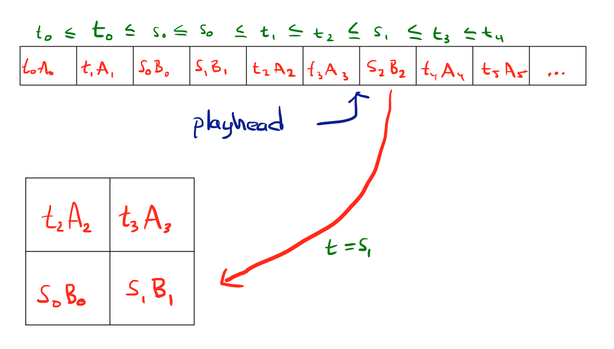

# Low Level Animation -- Part 2

Some time ago I wrote an [article](http://bitsquid.blogspot.com/2009/11/bitsquid-low-level-animation-system.html) describing how animation compression is implemented in the BitSquid engine. In that article I made a vague promise that I would follow up with a description of how to pack the data in a cache-friendly way. Now, the time has come to deliver on that vague promise.

A quick recap: After curve fitting, each track of our animation consists of a number of curve points that describe the curve for each animation track:

By an *animation track* I mean the animation of a single parameter, typically the position or rotation of a bone.

The data for the track is a sequence of times and curve data:

Here *t_i* is the time of a curve point and *A_i* is the corresponding curve data.

To evaluate the curve at any particular point t we need the curve points both before and after the time t

Depending on what curve type you use (hermite, bezier, b-spline, etc) you might actually need more than two curve points to evaluate a segment, but that doesn’t really affect the discussion in this article, so for the sake of simplicity, let’s stick with two.

Note that the time points for the different tracks in the animation typically do not match up. For example, one curve may be completely flat and only require one sample at the start and one sample at the end. Another curve may be complicated and require lots of samples.

To simplify the discussion further, assume that the animation only contains two tracks (it is easy to generalize the solution to more tracks). We will call the curve points of one (t_i, A_i) and the curve points of the other (s_i, B_i):

How can we organize this data to be as cache friendly as possible?

The most natural approach is perhaps to sort the data first by track and then by time. Let’s see what this means for the cache. To evaluate the animation for some particular time t, we have to go into the data for each track at that time to look up the two neighboring curve points. Let’s assume that we have somehow cached our current position in each track, so that we don’t have to search for it, we will still have at least one cache miss for each track. A modern character can have over 100 bones, with two tracks per bone. That’s 200 cache misses for just a single frame of a single animation.

To do better, we need to organize the data by time somehow. But it is not immediately clear how. Just sorting the data by time won’t help, because then a flat curve with just two curve points, one at the beginning and one at the end, will have them at complete opposite ends of the data and no matter what we do we will get cache misses when touching them.

Let’s consider all the data we need to evaluate the tracks at time t. We need (t_i, A_i), (t_i+1, A_i+1) and (s_j, B_j), (s_j+1, B_j+1) where t_i <= t <= t_i+1 and s_j <= t <= s_j+1. This is our ”hot” data, because we will need to refer to it several times as we evaluate the curve at different points in time. In fact, we can keep using this same data until we reach whichever is smallest of t_i+1 and s_j+1. A general rule in memory access optimization is to keep the ”hot” data together, so let’s create an additional data structure, an array with the currently active curve points for a playing animation instance.

Now we’re getting somewhere. Not only have we significantly improved the cache behavior; as long as we don’t need to fetch new curve points we only need to refer to the active array, a single memory access. We have also decomposed our animation evaluation problem into two simpler tasks: evaluating curves and fetching new curve points. This makes our code both simpler and more flexible.

Let’s look at the second issue, fetching new curve points. In the example above, when we reach the time t_i+1 we will need to fetch the new curve point (t_i+2, A_i+2) and when we reach the time s_j+1 we will need to fetch (s_j+2, B_j+2).

Generalizing, we always need to fetch the point (t_i, A_i) at the time t_i-1, and we always need to fetch the point (s_i, B_i) at the time s_i-1. This is excellent, because since we now the time when each of our curve points will be needed we can put them all in a single stream of data which is sorted by the time when they will be needed.

This means that our animation player only needs to keep a single pointer into the animation stream. That pointer will always point to the next curve point that needs to be moved to the active list. As time is advanced, curve points are copied from the animation data into the active list and then the curve is evaluated.

Note the excellent cache behavior this gives us. To fetch new curve points, we just move a pointer forward in memory. And then, to evaluate the curves, we just need to access our active array, a single continuous memory block. This gives us a grand total of just two memory accesses.

Another nice property is that since we are now accessing the animation data as a stream (strictly linearly, from beginning to end) we can gzip it and get another factor two of compression. We can also easily stream it from disk.

One drawback of this system is that it only supports playing an animation forward, you cannot jump to a particular time in an animation without ”fast forwarding” through all intermediate curve points.

If you need support for jumping, the easiest way to achieve it is perhaps to add a separate index with jump frames. A jump frame consists of the state of the active array at some point in time, together with an offset into the data stream. In other words, all the state information that the animation player needs to jump to that time point and resume playing.

Using jump frames let’s you balance performance and memory use. If you add more jump frames you will use more memory but on the other hand, you will be able to find a jump frame closer to the time you actually want to go to which means less fast forwarding.