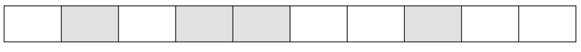
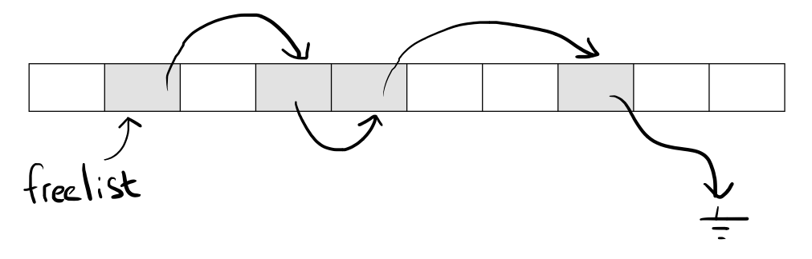
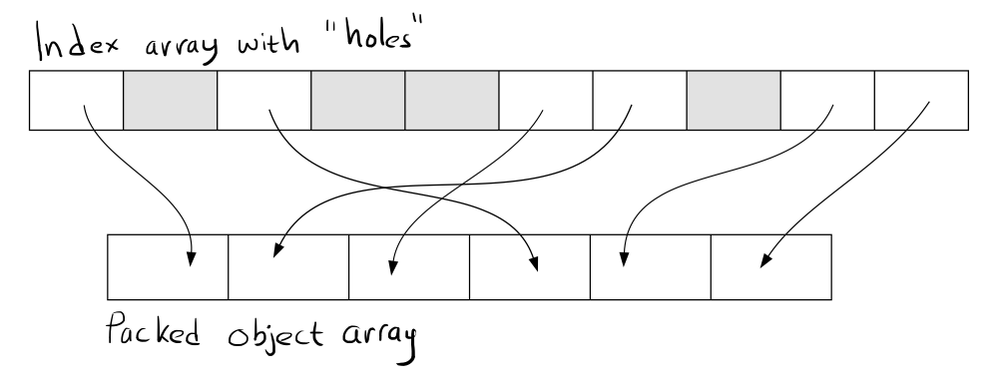

# Managing Decoupling Part 4 -- The ID Lookup Table

Today I am going to dig deeper into an important and versatile data structure that pops up all the time in the BitSquid engine -- the ID lookup table.

I have [already talked](http://altdevblogaday.com/2011/01/26/managing-decoupling/) about the advantages of using IDs to refer to objects owned by other systems, but let me just quickly recap.

IDs are better than direct pointers because we don’t get dangling references if the other system decides that the object needs to be destroyed.

IDs are better than `shared_ptr<>` and `weak_ptr<>` because it allows the other system to reorganize its objects in memory, delete them at will and doesn’t require thread synchronization to maintain a reference count. They are also POD (plain old data) structures, so they can be copied and moved in memory freely, passed back and forth between C++ and Lua, etc.

By an ID I simply mean an opaque data structure of *n* bits. It has no particular meaning to us, we just use it to refer to an object. The system provides the mechanism for looking up an object based on it. Since we seldom create more than 4 billion objects, 32 bits is usually enough for the ID, so we can just use a standard integer. If a system needs a lot of objects, we can go to 64 bits.

In this post I’m going to look at what data structures a system might use to do the lookup from ID to system object. There are some requirements that such data structures need to fulfill:

* There should be a 1-1 mapping between live objects and IDs.

* If the system is supplied with an ID to an old object, it should be able to detect that the object is no longer alive.

* Lookup from ID to object should be very fast (this is the most common operation).

* Adding and removing objects should be fast.

Let’s look at three different ways of implementing this data structure, with increasing degrees of sophistication.

## The STL Method

The by-the-book object oriented approach is to allocate objects on the heap and use a `std::map` to map from ID to object.

```cpp
typedef unsigned ID;

struct System
{
	ID _next_id;
	std::map<ID, Object *> _objects;

	System() {_next_id = 0;}

	inline bool has(ID id) {
		return _objects.count(id) > 0;
	}
	
	inline Object &lookup(ID id) {
		return *_objects[id];
	}
	
	inline ID add() {
		ID id = _next_id++;
		Object *o = new Object();
		o->id = id;
		_objects[id] = o;
		return id;
	}
	
	inline void remove(ID id) {
		Object &o = lookup(id);
		_objects.erase(id);
		delete &o;
	}
};
```

Note that if we create more than four billion objects, the `_next_id` counter will wrap around and we risk getting two objects with the same ID.

Apart from that, the only problem with this solution is that it is really inefficient. All objects are allocated individually on the heap, which gives bad cache behavior and the map lookup results in tree walking which is also bad for the cache. We can switch the map to a `hash_map` for slightly better performance, but that still leaves a lot of unnecessary pointer chasing.

## Array With Holes

What we really want to do is to store our objects linearly in memory, because that will give us the best possible cache behavior. We can either use a fixed size array `Object[MAX_SIZE]` if we know the maximum number of objects that will ever be used, or we can be more flexible and use a `std::vector`.

**Note:** If you care about performance and use `std::vector<T>` you should make a variant of it (call it `array<T>` for example) that doesn’t call constructors or initializes memory. Use that for simple types, when you don’t care about initialization. A dynamic `vector<T>` buffer that grows and shrinks a lot can spend a huge amount of time doing completely unnecessary constructor calls.

To find an object in the array, we need to know its index. But just using the index as ID is not enough, because the object might have been destroyed and a new object might have been created at the same index. To check for that, we also need an id value, as before. So we make the ID type a combination of both:

```cpp
struct ID {
	unsigned index;
	unsigned inner_id;
};
```

Now we can use the index to quickly look up the object and the `inner_id` to verify its identity.

Since the object index is stored in the ID which is exposed externally, once an object has been created it cannot move. When objects are deleted they will leave holes in the array.



When we create new objects we don’t just want to add them to the end of the array. We want to make sure that we fill the holes in the array first.

The standard way of doing that is with a free list. We store a pointer to the first hole in a variable. In each hole we store a pointer to the next hole. These pointers thus form a linked list that enumerates all the holes.



An interesting thing to note is that we usually don’t need to allocate any memory for these pointers. Since the pointers are only used for holes (i. e. dead objects) we can reuse the objects’ own memory for storing them. The objects don’t need that memory, since they are dead.

Here is an implementation. For clarity, I have used an explicit member next in the object for the free list rather than reusing the object’s memory:

```cpp
struct System
{
	unsigned _next_inner_id;
	std::vector<Object> _objects;
	unsigned _freelist;

	System() {
		_next_inner_id = 0;
		_freelist = UINT_MAX;
	}

	inline bool has(ID id) {
		return _objects[id.index].id.inner_id == id.inner_id;
	}
	
	inline Object &lookup(ID id) {
		return _objects[id.index];
	}
	
	inline ID add() {
		ID id;
		id.inner_id = _next_inner_id++;
		if (_freelist == UINT_MAX) {
			Object o;
			id.index = _objects.size();
			o.id = id;
			_objects.push_back(o);
		} else {
			id.index = _freelist;
			_freelist = _objects[_freelist].next;
		}
		return id;
	}
	
	inline void remove(ID id) {
		Object &o = lookup(id);
		o.id.inner_id = UINT_MAX;
		o.next = _freelist;
		_freelist = id.index;
	}
};
```

This is a lot better than the STL solution. Insertion and removal is O(1). Lookup is just array indexing, which means it is very fast. In a quick-and-dirty-don’t-take-it-too-seriously test this was 40 times faster than the STL solution. In real-life it all depends on the actual usage patterns, of course.

The only part of this solution that is not an improvement over the STL version is that our ID structs have increased from 32 to 64 bits.

There are things that can be done about that. For example, if you never have more than 64 K objects live at the same time, you can get by with 16 bits for the index, which leaves 16 bits for the `inner_id`. Note that the `inner_id` doesn’t have to be globally unique, it is enough if it is unique for that index slot. So a 16 bit `inner_id` is fine if we never create more than 64 K objects in the same index slot.

If you want to go down that road you probably want to change the implementation of the free list slightly. The code above uses a standard free list implementation that acts as a LIFO stack. This means that if you create and delete objects in quick succession they will all be assigned to the same index slot which means you quickly run out of inner_ids for that slot. To prevent that, you want to make sure that you always have a certain number of elements in the free list (allocate more if you run low) and rewrite it as a FIFO. If you always have *N* free objects and use a FIFO free list, then you are guaranteed that you won’t see an inner_id collision until you have created at least *N \* 64 K* objects.

Of course you can slice and dice the 32 bits in other ways if you hare different limits on the maximum number of objects. You have to crunch the numbers for your particular case to see if you can get by with a 32 bit ID.

## Packed Array

One drawback with the approach sketched above is that since the index is exposed externally, the system cannot reorganize its objects in memory for maximum performance. 

The holes are especially troubling. At some point the system probably wants to loop over all its objects and update them. If the object array is nearly full, no problem, But if the array has 50 % objects and 50 % holes, the loop will touch twice as much memory as necessary. That seems suboptimal.

We can get rid of that by introducing an extra level of indirection, where the IDs point to an array of indices that points to the objects themselves:



This means that we pay the cost of an extra array lookup whenever we resolve the ID. On the other hand, the system objects are packed tight in memory which means that they can be updated more efficiently. Note that the system update doesn’t have to touch or care about the index array. Whether this is a net win depends on how the system is used, but my guess is that in most cases more items are touched internally than are referenced externally.

To remove an object with this solution we use the standard trick of swapping it with the last item in the array. Then we update the index so that it points to the new location of the swapped object.

Here is an implementation. To keep things interesting, this time with a fixed array size, a 32 bit ID and a FIFO free list.

```cpp
typedef unsigned ID;

#define MAX_OBJECTS 64*1024
#define INDEX_MASK 0xffff
#define NEW_OBJECT_ID_ADD 0x10000

struct Index {
	ID id;
	unsigned short index;
	unsigned short next;
};

struct System
{
	unsigned _num_objects;
	Object _objects[MAX_OBJECTS];
	Index _indices[MAX_OBJECTS];
	unsigned short _freelist_enqueue;
	unsigned short _freelist_dequeue;

	System() {
		_num_objects = 0;
		for (unsigned i=0; i<MAX_OBJECTS; ++i) {
			_indices[i].id = i;
			_indices[i].next = i+1;
		}
		_freelist_dequeue = 0;
		_freelist_enqueue = MAX_OBJECTS-1;
	}

	inline bool has(ID id) {
		Index &in = _indices[id & INDEX_MASK];
		return in.id == id && in.index != USHRT_MAX;
	}
	
	inline Object &lookup(ID id) {
		return _objects[_indices[id & INDEX_MASK].index];
	}
	
	inline ID add() {
		Index &in = _indices[_freelist_dequeue];
		_freelist_dequeue = in.next;
		in.id += NEW_OBJECT_ID_ADD;
		in.index = _num_objects++;
		Object &o = _objects[in.index];
		o.id = in.id;
		return o.id;
	}
	
	inline void remove(ID id) {
		Index &in = _indices[id & INDEX_MASK];
		
		Object &o = _objects[in.index];
		o = _objects[--_num_objects];
		_indices[o.id & INDEX_MASK].index = in.index;
		
		in.index = USHRT_MAX;
		_indices[_freelist_enqueue].next = id & INDEX_MASK;
		_freelist_enqueue = id & INDEX_MASK;
	}
};
```