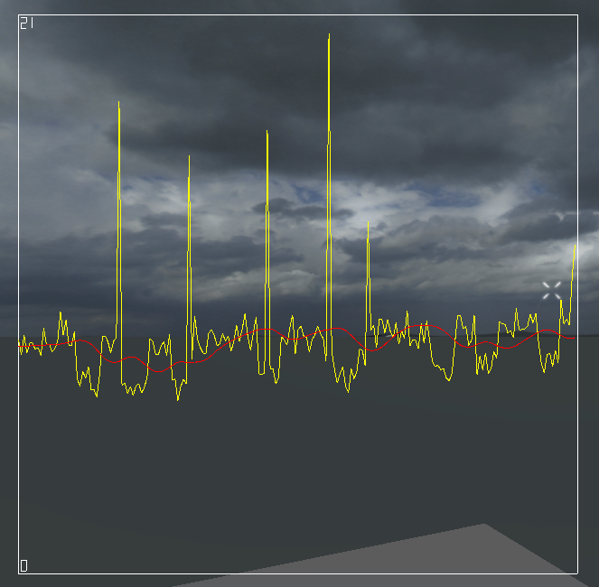
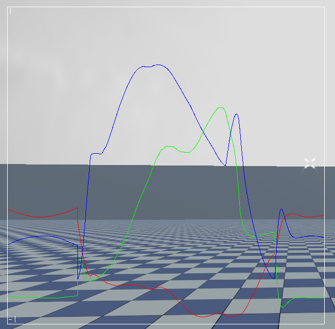
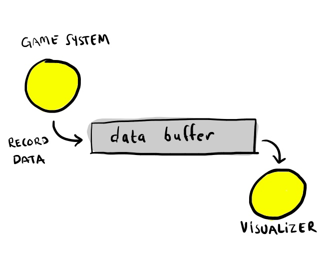
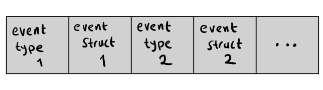
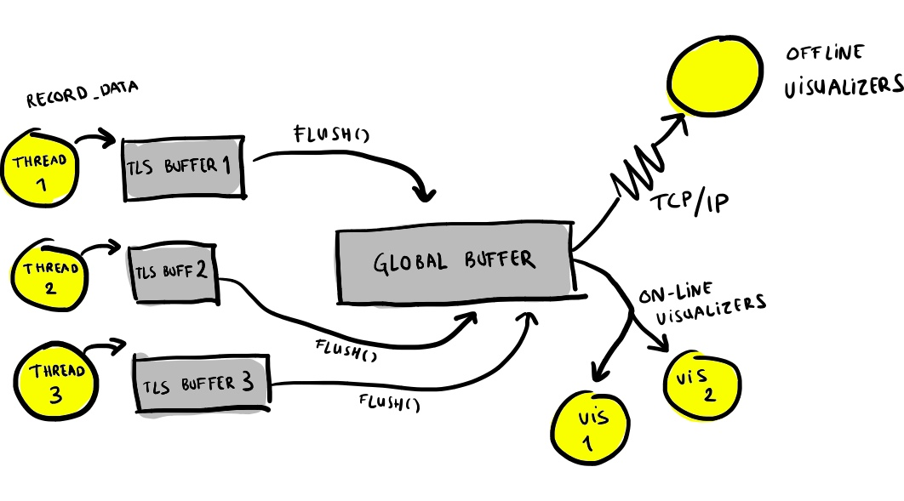
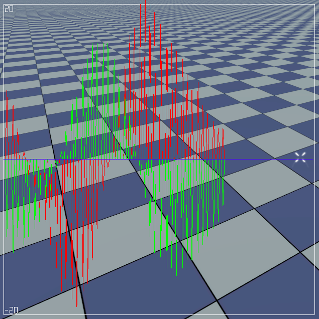

# Monitoring your game

Many bugs are easy to fix with debuggers, stack traces and printf-statements. But some are hard to even see with such tools. I'm thinking of things like frame rate hitches, animation glitches and camera stutters. You can't put a breakpoint on the glitch because what constitutes a glitch is only defined in relation to what happened in the frame before or what will happen in the next frame. And even if you are able to break exactly when the glitch occurs, you might not be able to tell what is going on from the call stack.

In these situations, some way of monitoring and visualizing your game's behavior can be invaluable. Indeed, if we graph the delta time for each frame, the hitches stand out clear as day.



*Delta-time graph with frame rate drops.*

A graph like this opens up many new ways of attacking glitch bugs. You can play the game with the graph displayed and try to see what game actions trigger the glitches. Do they happen when a certain enemy is spawned? When a particular weapon is fired? Another approach is to draw the total frame time together with the time spent in all the different subsystems. This immediately shows you which subsystem is causing the frame rate to spike. You can constrain the problem further by graphing the time spent in narrower and narrower profiler scopes.

Visualization tools like these can help with many other issues as well. Want to find out where a weird camera stutter comes from? Plot the camera position, the position of its look-at target and any other variables that may influence its behavior to pin down the source of the problem. Draw a [graph representing your memory fragmentation](http://altdevblogaday.org/2011/05/17/a-birds-eye-view-of-your-memory-map/) to find problematic allocations and get an overall feeling for how bad the situation is. Does something look slightly off with the animations? Graph the bone rotations to make sure that you don't have any vibrations or discontinuities. Graph your network usage to make sure you stay below the bandwidth cap.



*Rotation of a bone during a jump animation.*

When you study your game in this way, you will most likely learn things that surprise you. Games are highly complex systems built by a large number of people over a long period of time. As all complex systems they show emergent behavior. You can be quite certain that at least someone has done at least done something that is *completely unexpected* and *totally weird*. You can't hope to discover these things using just a bottom-up approach. There is too much code and too much data. Instead you must study your game as if it was an alien organism. Prod it and see how it reacts. Keep the graphs on screen and make sure that they look sane.

There are many different kinds of data that can be interesting and many ways of visualizing them - graphs, bars, charts, etc. But in all cases the pattern is pretty much the same. We have some data that we record from the game and then we have a visualizer that takes this data and draws it in some interesting way. Schematically, we can represent it like this:



*Basic monitoring system schematic.*

I will refine this picture shortly, but first lets do a little data-oriented design and ask ourselves how we can best store and process this data.

If you have read any of my earlier blog posts you will know that I'm a fan of big dumb continuous memory buffers and data structures that look like "file formats for memory". And this approach works perfectly for this problem. We can just store the data as a big block of concatenated structs, where each struct represents some recorded data. We begin each record with an enum specifying the type of recorded event and follow that with a variable sized struct with data for that particular event.



*Data buffer layout.*

The event types might be things such as ENTER_PROFILER_SCOPE, LEAVE_PROFILER_SCOPE, ALLOCATE_MEMORY, FREE_MEMORY, RECORD_GLOBAL_FLOAT, etc.

RECORD_GLOBAL_FLOAT is the event type used for all kinds of data that we want to draw in graphs. We record the data with calls like these:

```cpp
record_global_float("application.delta_time", dt);
record_global_float("application.frame_rate", 1.0f / dt);
```

The corresponding data struct is just:

```cpp
struct RecordGlobalFloatEvent {
    const char *name;
    float value;
};
```

Note that there is an interesting little trick being used here. When we record the events, we just record the string *pointers*, not the complete string data. This saves memory, makes the struct fixed size and gives us faster string compares. This works because *record_global_float()* is called with static string data that is always at the same address and kept in memory throughout the lifetime of the application. (In the rare case where you want to call *record_global_float()* with a dynamic string, you must allocate a copy of that string at some permanent location, i.e. do a form of [string interning](http://en.wikipedia.org/wiki/String_interning).)

Now, let's refine the picture slightly. There is a problem with recording all data to a single memory buffer and that is multithreading. If all threads record their data to the same memory buffer then we need lots of mutex locking to make sure they don't step on each other's toes.

We might also want to add support for some kind of off-line (i.e., not in-game) visualization. Off-line visualizers can take advantage of the full power of your development PC to implement more powerful visualization algorithms. And since they have near unlimited memory, they can record the entire data history so that you can explore it back and forth after the game session has ended.

With these refinements our monitoring system now looks like this:



*Advanced monitoring system schematic.*

Each thread has a small TLS (thread-local-storage) cache with 64 K or so of debug memory where it records its events. When the cache gets full or we reach the end of the frame, the thread acquires the lock to the global event buffer and flushes its data there.

The active on-line visualizers process the events in the buffer and visualize them. Simulatenously, we send the data over TCP so that it can be processed by any off-line visualizers. In the process we consume the buffer data and the buffer can be filled with new data from the threads.

(We allocate all the buffers we use on a special debug heap, so that we separate the allocations which we only do for debugging purposes from the allocations done by the main game.)

Recording float data requires just a few lines of code.

```cpp
enum RECORD_GLOBAL_FLOAT_EVENT = 17;
enum THREAD_BUFFER_SIZE = 64*1024;
__thread char *_thread_buffer;
__thread unsigned _thread_buffer_count;

inline void record_global_float(const char *name, float value)
{
     if (_thread_buffer_count + 12 > THREAD_BUFFER_SIZE)
         flush_thread_buffer();
     
     char *p = _thread_buffer + _thread_buffer_count
     *(unsigned *)p = GLOBAL_FLOAT;
     *(RecordGlobalFloatEvent *)(p+4).name = name;
     *(RecordGlobalFloatEvent *)(p+4).value = value;
    thread_buffer_count += 12;
}
```

When you have the data, writing the graph visualizer is not much work. Just save the data over a couple of frames and plot it using a line drawer.

In the BitSquid engine, we also expose all the data recording functions to Lua scripting. This makes it possible to dynamically create graphs for all kinds of data while the game is running.

As an example of this, a couple of days ago a game programmer suspected that some problematic behavior was caused by a low update frequency in the mouse driver. We quickly bashed out a couple of lines in the game console to produce a graph of the mouse data and could immediately confirm that this indeed was the case:

```cpp
Core.Debug.add_updator(
  function ()
    Profiler.record_statistics("mouse", Mouse.axis(0))
  end 
)
```

```
graph make mousegraph
graph add_vector3 mousegraph mouse
graph range mousegraph -20 20
```



*Graph of mouse input showing frames with no input.*