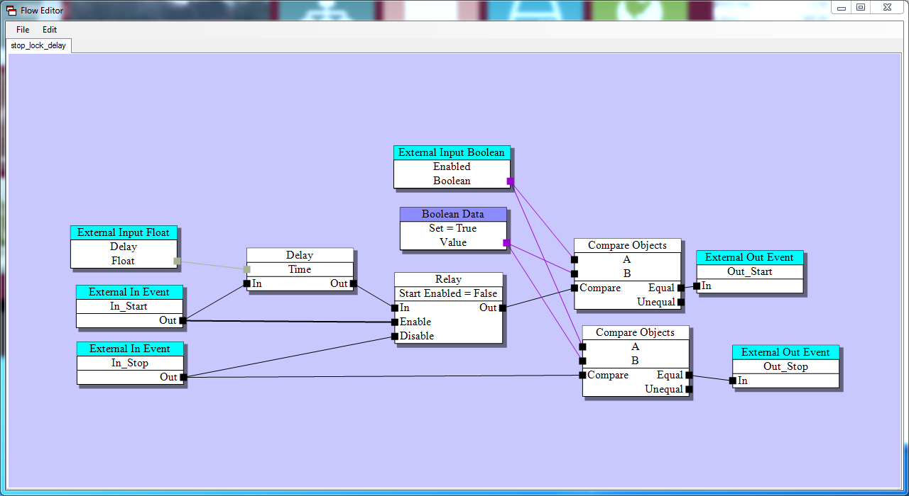
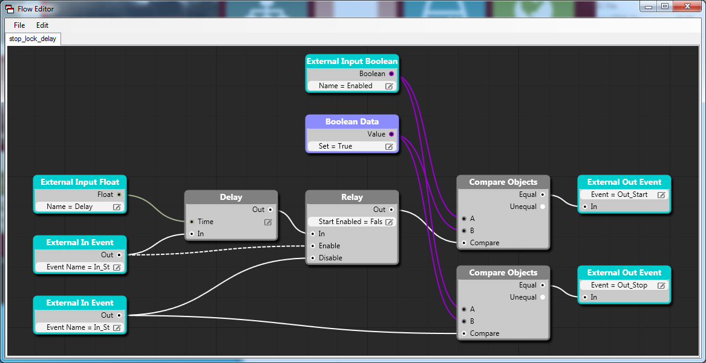
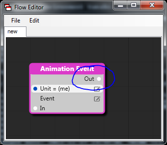
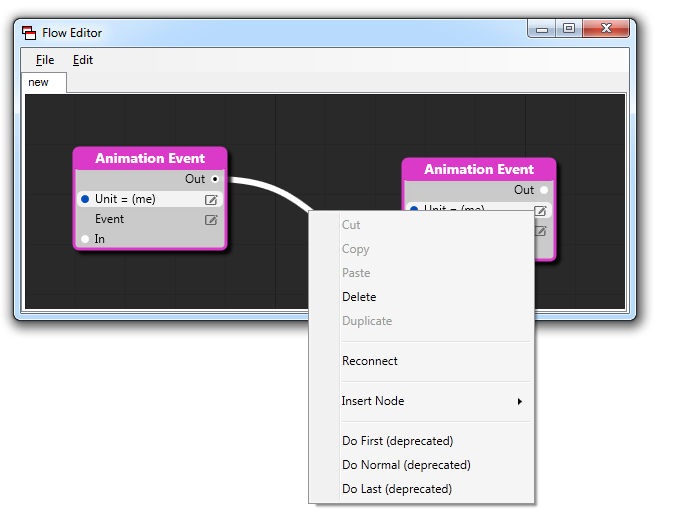
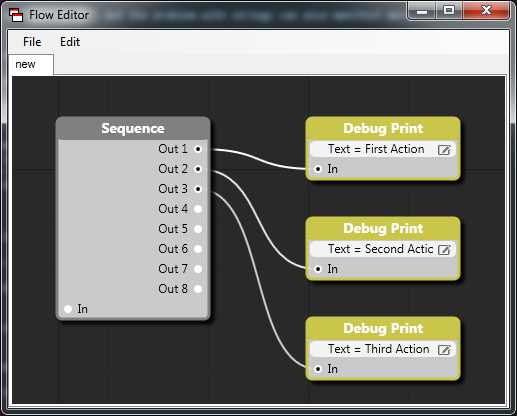
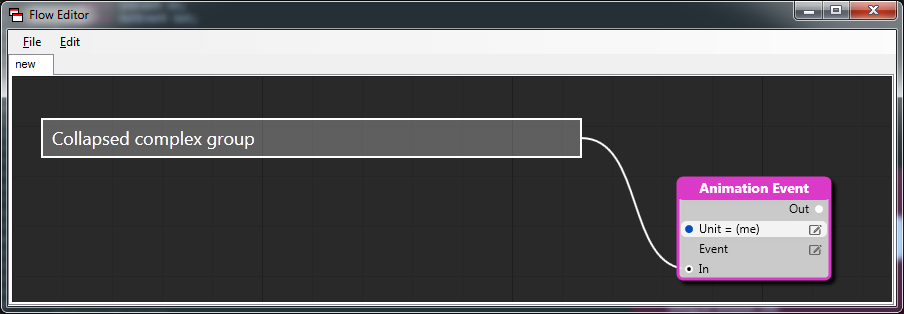

# Four meditations on bad design decisions

I've recently been doing a major rewrite of one of our core engine systems, the graph that we use for our visual scripting language *Flow*. Taking it from something that looks like this:



To something that looks like this:



A major rewrite like this is always a humbling experience. When you have to rewrite your own code, every bad decision you made comes back to haunt you. And you don't have anybody else to blame them on.

As if facing your own inadequacy wasn't enough -- rewriting an existing system is always harder than writing one from scratch. When you write a new system you start with a blank slate and can do whatever you want. When you rewrite, you are constrained by what the old system did -- at least if you want to maintain any kind of backwards compatibility.

In addition, a new system can be written iteratively. You can start with a very small, simple system, release early and get feedback. Based on that feedback you can tweak the system. You don't have to think about adding features until you have a good stable base.

When you are doing a rewrite you can't release the new system until it is *at least as good* as the old one. Otherwise, your users will question why you have spent all that time working on a system that is *worse* than what you had before. And they will be right.

So a rewrite forces you away from the comfortable land of early releases and quick iterations and into the ugly old waterfall model.

With the power of hindsight, I'd like to reflect a bit on four design mistakes I made when I wrote the first version of the system that made this rewrite a lot harder than it could have been.

## Don't use strings for non-text things

Strings have one really good use -- to hold pieces of text that either gets displayed to or inputted by the user. All other use of strings should be regarded as suspicious.

Strings are scary because they are both ambiguous and powerful. Does "a/b.txt" and "A//b.txt" represent the same path? Hard to tell. But maybe you can use case conversion, search and replace and some regular expression monstrosity to figure that out.

If you are doing that kind of string manipulation in any part of the code that is not directly related to user input or output, it is a clear warning sign that your code might be too "stringified".

The most obvious example stringified code is the use of "stringly typed" data, for example, storing a date as the string "2012-12-09". But the problem with strings can also manifest more subtle ways.

The original version of Flow used strings to identify connectors, both internally (as a representation of the connection) and visually (to show the name of the connector):



As a consequence, a Flow node couldn't have two connectors with the same name, and a connector couldn't be renamed (even visually) without breaking all existing connections.

In retrospect, rather than having a single *Name* property, it would be much better to have separate *Id* and *DisplayName* properties. The *Id* would be a *GUID* that uniquely identified the property, and the *DisplayName* would be a (localizable) name, suitable for displaying to the end user.

Using names/strings as identifiers has bitten me in other ways as well. In one system I knew that the names had to be unique (because that is how the script would refer to the objects) so I thought it would be safe to use them as identifiers. What I didn't consider was that there could be situations when there *temporarily* were two objects that had the same name. For example, if the user had created a *rock* object, and wanted to create a *rock_small* object -- as she was half-way through typing that name, there would suddenly be two objects named *rock*. This created problems for the system.

Lesson learned, I now avoid using strings as identifiers.

## When in doubt, you should opt-out

Every system acquires features over time. That is good of course. Those features make the system more powerful and easier to work with.

But among the good features there are usually a few that don't feel quite right. That don't really fit into the design of the system. You can *do* them of course. You can do anything.

But usually it is best not to. Most of the time when I have added a feature that didn't quite feel right, I have regretted it later. In retrospect it would have been better to try to find a different way of doing what the user's wanted that was more natural to the ideas behind the system.

An example: User's of Flow wanted some way to specify the order in which events were triggered, when multiple connections are connected to the same *Out* connector.  This is needed in some situations, for example you may want to make sure that a unit is spawned before it is used.

In the old version of Flow, this was implemented with a context menu on the connection where you could select if it should be a "Do First", "Do Last" or "Do Normal" connection.



This solution never felt 100 % right to me. It was hard to find a good intuitive way to visually represent the "Do First" and "Do Last" connections, and as a result the Flow graphs became harder to understand. 

In retrospect, it would have been much better to avoid this feature and wait until I had come up with the more elegant alternative: a sequence node that triggers each of its outputs sequentially:



## Be explicit or you'll miss it

Writing code where a lot of things happen implicitly feels great -- to begin with. It is amazing how much you are able to do with just a few lines of code.

But in my experience, implicit code almost always ends up more costly in the long run. It is harder to understand, harder to debug and harder to change. It tends to lock you down in a "local minimum" that can be tricky to come out of.

In Flow, a lot of things are done implicitly. The definition of a Flow node is just a simple C# class:

```
[Category("Animation")]
public class AnimationEvent : Node
{
    public InVariableUnit Unit;
    public StringVariable Event;
    public InEvent In;
    public OutEvent Out;
}
```

Through reflection, Flow finds out the members in the class and their types and automatically generates Flow nodes for them. This process involves some ugly string processing (bad decision #1), such as stripping *In* and *Variable* from the type name to find the underlying type of members. Reflection is also used to serialize the graphs.

While it is nice to be able to express a node so concisely, there are also a lot of problematic consequences. For example, since the class names get serialized, we can't change the names of classes or properties without breaking the ability to load old files. Also, we have to use some *really* ugly C# hacks to make sure that the reflection system always returns the members of a class in the order they are declared in the file (so that we can control the order of the connectors).

In retrospect, it would been much better to avoid all this clever reflection stuff and instead just define the node types in configuration files.

## Avoid the road of complex code

There is some code that needs to be complex, because it is dealing with fundamentally tricky stuff (like computational geometry) or because it needs to run *really*, *really* fast. But in all other cases, complexity is just a cost.

If your code starts to feel complex and hard to keep track of, it is a sign that you are probably doing something wrong. And if you are not careful, you may lock yourself in, so that when you write the next version of the system, you have to recreate all that complex behavior in your new, simpler system. You have to deliberately make your code uglier.

The old version of Flow had a way of "folding" nodes. You could select a number of nodes, group them, and then "fold" the group, collapse it to a single node.

The system had a lot of really hairy code for dealing with this. The code takes a bunch of nodes and creates a new node from them, with connectors matching only the external connectors of the collapsed nodes. it also keeps track of the internal nodes and their connections so they can be recreated if the node is later "expanded".

As you might imagine, this was complicated further by the need for connector names to be unique (see bad decision #1), which meant that some of the external connectors in the new node had to be renamed (since they could come from different internal nodes that had connectors with the same name). So a mapping table was needed to keep track of these renames. Obviously a bad idea, but once you have started down the path of wrongness, it can be hard to turn around.

The new version handles this a lot better. Collapse and expansion is just a visual feature. There are no new nodes created and no other strange things happening to the data, the visualizer just chooses to draw the data in a different way when it is collapsed. In retrospect, that is a much better choice.



```
That is all, four simple lessons
to guide your future coding sessions
now let your code be light and merry
until its time for Charon's ferry
```
