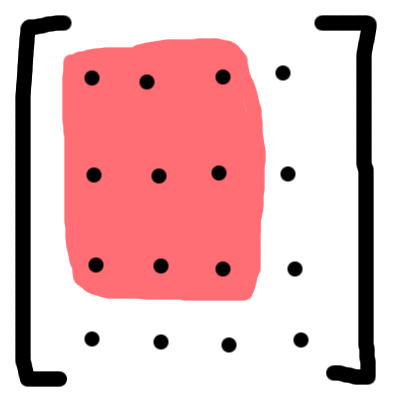

# Matrices, Rotation, Scale and Drifting

If you are using Matrix4x4s to store your node transforms and want to support scaling you are facing an annoying numerical problem: rotating a node causes its scale to drift from the original value.

## The cause of drifting

Drifting happens because in a Matrix4x4 the rotation and the scale are stored together in the upper left 3x3 part of the matrix:



This means that if we want to change the rotation of a Matrix4x4 without affecting the scale we must extract the scale and reapply it:

```cpp
void set_rotation(Matrix4x4 &amp;pose, const Quaternion &amp;rot)
{
     Vector3 s = scale(pose);
     Matrix3x3 rotm = matrix3x3(rot);
     scale(rotm, s);
     set_3x3(pose, rotm);
}
```

The problem here is that since floating point computation is imprecise, `scale(pose)` is not guaranteed to be exactly the same before this operation as after. Numerical errors will cause a very small difference. So even though we only intended to rotate the node we have inadvertently made it ever so slightly bigger (or smaller).

Does it matter? Sure, it is annoying that an object that we didn't want to have any scaling at all suddenly has a scale of 1.0000001, but surely such a small change would be impercievable and couldn't affect gameplay.

True, if we only rotated the object once. However, if we are dealing with an animated or spinning object we will be changing its rotation every frame. So if the error is 0.0000001 the first frame, it might be 0.0000002 the second frame and 0.0000003 the third frame.

Note that the error growth is linear rather than geometric because the error in each iteration is proportional to the current *scale*, not to the current error. I. e., to *(1 + e)* rather than *e*. We can assume that *1 >> e*, because otherwise we already have a clearly visible error.

I ran a test using our existing math code. Rotating a transform using the method described above yields the following result:

|Error|Frames|Time (at 60 Hz)|
|---|---|---|
|0.000001|202|3 s|
|0.000002|437|7 s|
|0.000005|897|15 s|
|0.000010|1654|28 s|
|0.000020|3511|58 s|
|0.000050|8823|2 min|
|0.000100|14393|4 min|
|0.000200|24605|7 min|
|0.000500|52203|15 min|
|0.001000|100575|28 min|

As you can see, after 28 minutes we have an error of 0.1 %. At this point, it starts to get noticeable.

You could debate if this is something that needs fixing. Maybe you can live with the fact that objects grow by 0.1 % every half hour, because your game sessions are short and the small scale differences will never be noted. However, since Bitsquid is a general purpose engine, we need a better solution to the problem.

At this point, you might be asking yourself why this problem only happens when we introduce scaling. Don't we have the same issue with just translation and rotation? No, because translation and rotation are stored in completely separate parts of the matrix:


Setting the rotation doesn't touch any of the position elements and can't introduce errors in them, and vice versa.

## Solutions to scale drifting

I can think of four possible solutions to this problem:

* Store rotation and scale separately
* Always set rotation and scale together
* Quantize the scale values
* Prevent systematic errors

### Solution 1: Store rotation and scale separately

The root cause of the problem is that rotation and scale are jumbled together in the Matrix4x4. We can fix that by separating them. So instead of using a Matrix4x4 we would store our pose as:

```cpp
struct Pose {
      Vector3 translation;
      Matrix3x3 rotation;
      Vector3 scale;
};
```

With the pose stored like this, changing the rotation does not touch the scale values, so we have eliminated the problem of drifting.

Note that this representation is actually using slightly less memory than a Matrix4x4 -- 15 floats instead of 16. (We could reduce the storage space even further by storing the rotation as a quaternion, but then it would be more expensive to convert it to matrix form.)

However, the representation is not as convenient as a Matrix4x4. We can't compose it or compute its inverse with regular matrix operations, as we can do for a Matrix4x4. We could write custom operations for that, or we could just convert this representation to a temporary Matrix4x4 whenever we needed those operations.

Converting to a Matrix4x4 requires initializing the 16 floats (some with values from the pose) and 9 floating point multiplications (to apply the scale). What kind of a performance impact would this have?

I would guess that the part of the codebase that would be most affected would be the scene graph local-to-world transformation. With this solution, you would want to store the local transform as a Pose and the world transform as a Matrix4x4. The local-to-world transform requires about 36 multiplications and 36 additions (says my quick estimate). So adding a temp Matrix4x4 conversion would take you from 72 to 81 FLOPS.

So a very rough estimate is that this change would make your scene graph transforms about 12 % more expensive. Likely, the real value is less than that since you probably have additional overhead costs that are the same for both methods. And of course, the scene graph transforms are just one small (and parallelizable) part of what your engine does. We rarely spend more than 2 % of our frame time there, meaning the total performance hit is something like 0.2 %.

I think that is a quite reasonable price to pay for a neat solution to the problem of drifting, but you may disagree of course. Also, perhaps the use of Matrix4x4s is so ingrained in your code base that it is simply not possible to change it. So let's look at the other possible solutions.

### Solution 2: Always set rotation and scale together

The fundamental problem with *set_rotation()* is that we try to change just the orientation of the node without affecting the scale. Extracting the scale and reapplying it is what causes the drifting.

If we don't allow the user to just change the rotation, but force him to always set the scale and the rotation together, the problem disappears:

```cpp
void set_rotation_and_scale(Matrix4x4 &amp;pose, const Quaternion &amp;rot, const Vector3 &amp;s)
{
    Matrix3x3 rotm = matrix3x3(rot);
    scale(rotm, s);
    set_3x3(pose, rotm);
}
```

Since we have eliminated the step where we extract the scale and feed it back, we have rid ourselves of the feedback loop that caused runaway drifting. Of course, we haven't completely eliminated the problem, because nothing prevents the user from emulating what we did in *set_rotation()* and recreating the feedback loop:

```cpp
Vector3 s = scale(pose);
set_rotation_and_scale(pose, new_rotation, s);
```

Now the drifting problem is back with a vengeance, reintroduced by the user.

To prevent drifting the user must take care not to create such feedback loops. I.e., she can never extract the scale from the matrix. Instead she must store the scale at some other place (separate from the matrix) so that she can always feed the matrix with the correct scale value.

What we have done is essentially to move the burden of keeping track of the scale of objects from the transform (the Matrix4x4) to the user of the transform. This prevents drifting and doesn't have any performance costs, but it is pretty inconvenient for the user to have to track the scale of objects manually. Also, it is error prone, since the user who is not 100 % certain of what she is doing can accidentally recreate the feedback loop that causes drifting.

### Solution 3: Quantize the scale values

If none of the two options presented so far seem palpable to you, there is actually a third possibility.

Consider what would happen if we changed the *Vector3 scale(const Matrix4x4 &amp;)* function so that it always returned integer values.

Calling *set_rotation()* as before would introduce an error to the scale and set it to, say 1.0000001. But the next time we ran *set_rotation()* and asked for the scale it would be rounded to the nearest integer value, so it would be returned as 1 -- the correct value. Applying the new rotation would again introduce an error and change the value to 1.0000001, but then again, the next time the function ran, the value returned would be snapped back to 1.

So by rounding the returned scale to fixed discrete values we prevent the feedback loop. We still get small errors in the scale, but without the runaway effect they are unnoticeable. (Small errors occur everywhere, for example in the scene graph transforms. That's the nature of floating point computation. It is not the small errors that are the problem but the mechanisms that can cause them to result in visible effects.)

Of course, if we round to integer values we can only scale an object by 1, 2, 3, etc. Not by 0.5, for instance. But we can fix that by using some other set of discrete numbers for the scale. For example, we could round to the nearest 0.0001. This would let us have scales of 0.9998, 0.9999, 1.0000, 1.0001, 1.0002, … Hopefully that is enough precision to cover all the different scales that our artists might want to use.

Drifting won't happen in this scheme, because the floating point errors will never be big enough to change the number to the next discrete value. (Unless you used really large scale values. If you want to support that -- typically not interesting, because things like texture and vertex resolution start to look wonky -- you could use a geometric quantization scheme instead of an arithmetic one.)

Snapping the scale values in this way might be OK for static scaling. But what if you want to smoothly change the scaling with an animation? Won't the discrete steps cause visible jerks in the movement?

Actually not. Remember that it is only the value returned by *scale()* that is quantized, the user is still free to *set_scale()* to any non-quantized value. When the scale is driven by an animation, it is fed from an outside source. We don't need to read it from the matrix and reapply it. So the quantization that happens in *scale()* never comes into play.

So amazingly enough, this hacky solution of snapping the scale to a fixed set of discrete values actually seems to work for most real world problems. There might be situations where it would cause trouble, but I can't really come up with any.

### Solution 4: Prevent systematic errors

A final approach is to try to address *how* the numbers are drifting instead of stopping them from drifting. If you look at the table above you see that the errors are growing linearly. That is not what you would expect if the errors were completely random.

If the errors in each iteration were completely random, you would get a [random walk](http://en.wikipedia.org/wiki/Random_walk) process where the total error would be *e * sqrt(N)* rather than *e * N*, where *e* is the error from one iteration and *N* the number of iterations. The fact that the error grows linearly tells us that our computation has a systematic bias -- the error is always pushed in one particular direction.

If we could get rid of this systematic bias and get a truly random error, the accumulated error would grow much more slowly, the square root makes all the difference. For example, for the error to grow to 0.1 % it would take 5.2 years rather than 28 minutes. At that point, we might be ok with the drifting.

I haven't thought that much about what would be needed to get rid of the systematic bias in the *set_rotation()* function. It's a pretty tricky problem that requires a deep understanding of what happens to all the floating point numbers as they travel through the equations.

### Conclusion

In the Bitsquid engine we have so far gone with #2, as a make-shift until we decided on the best permanent solution to this problem. After reviewing the options in this article I think we will most likely go with #1. #3 is an interesting hack and I think it would work almost everywhere, but I'm willing to pay the slight performance price for the cleaner and clearer solution of #1.
