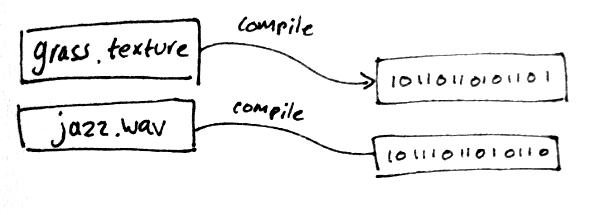
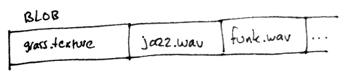
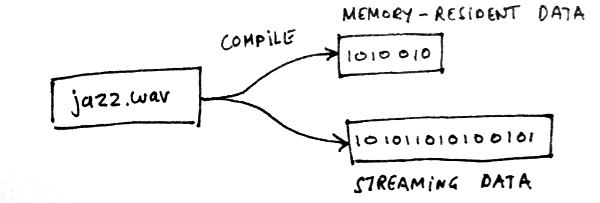
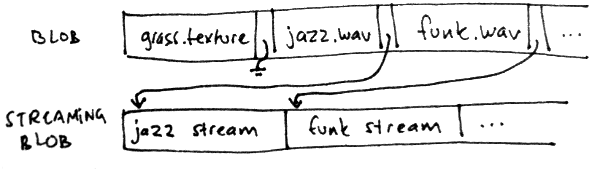

# Read my lips: No more loading screens

I've already talked a bit about how we manage resources in the Bitsquid engine, for example in:

* http://www.bitsquid.se/files/resource_management.html (a bit out of date now)
* http://bitsquid.blogspot.se/2012/03/cutting-pipe-achieving-sub-second.html (my GDC talk)

Today I want to focus on a particular aspect of resource management that I haven't discussed in any great detail before: *streaming*.

Streaming is good for two things:

* Getting rid of loading screens.
* Showing more detail/variety than we can fit in memory.

This is 2012, and according to the Mayans it is the last year anyone should have to be forced to look at a loading screen. Since I'm not directly involved in games production, but only make an engine, I can afford to make such broad, sweeping statements.

## A quick recap

Since the two links above are quite long reads, let's start with a quick summary of how our resource system works.

A *resource* in the Bitsquid engine is a piece of data uniquely identified by its *name* and *type*. For example:

|Type|Name|
|---|---|
|unit|units/beings/player|
|texture|vegetation/grass/tall_grass_01|
|wav|music/soft_jazz|

The resource files are created by our tools. They are human readable files written in a JSON-like format. Before they can be used in the runtime, they need to be *compiled*. The data compiler compiles each resource into a platform specific optimized binary blob:

For loading and unloading, the resources are grouped into *packages*. A package (itself a resource) is a list of resources that can be loaded and unloaded together.

In a very small game, the entire game could be a single package. In a larger game a package could contain all the resources for a particular level, or a tile set that is used in multiple levels. The gameplay programmers decide when to load and unload packages.

For the final release of the game, the packages are converted to *bundles*. A bundle contains all the compiled resources in a package concatenated together to a single file which is compressed by a stream compression filter. The engine loads the entire bundle in one go, without seeking. This is crucial for optic media, but it also really speeds up hard drive performance.

## Getting rid of loading screens

To get rid of loading screens we can use *package streaming*. By this I simply mean the ability to load new packages in the background while the engine is doing other things. This means that when the player is approaching a new area in the game, we can start downloading that data in the background, while she continues playing. When she arrives at the area, the data is already in memory and she can proceed without having to wait for a loading screen.

In the Bitsquid engine, packages are *always* loaded in the background, so package streaming is enabled by default. The gameplay programmer can tell the engine to start loading a package. The loading is handled by a separate background thread and the gameplay programmer can poll the engine every frame to determine if the loading has completed or not. When the loading is done she can start to use the new data.

It is up to the gameplay programmer to decide what the engine should do during the loading time. She can choose to stall the engine (ugh), show a loading screen (semi-ugh) or do something more interesting (yes, 2012!).

There are many different ways of organizing and structuring packages for successful streaming and the engine let's you use which ever method you prefer. Different solutions might work for different games. A game with linear progression could have a package for each "stage" and trigger download of the next one when the current is almost complete. An open world game could have a package for each section of the map, together with additional packages for "special" locations. A game with random encounters could have separate packages for the different encounters you can run into.

The fact that the engine doesn't have a hard-wired streaming model gives the designer a lot of power and flexibility. But with that power also comes a greater responsibility. The designer must bear the entire burden of setting up the packages correctly and deciding when to load them and unload them.

Perhaps in the future, we will pick one or two streaming models as "standard solutions" and provide some convenience functionality for them. You will of course still have the option to drop into "manual" mode for full flexibility if needed.

## Showing more detail

For showing more detail than can fit in memory we use something that I for lack of a better word call *resource streaming*. What resource streaming means is simply that for certain resources, we don't load the entire resource into memory when we load its package. We only keep the resource partially in memory and stream bits and pieces of it in and out as needed.

The simplest example of a streaming resource is perhaps a video file. Video files can contain hundreds of megabytes of data and we don't want to load all that into memory as one big blob. Instead we want to stream it in, frame by frame, as the video is being played.

Remember what I said in the recap, that each resource gets compiled into a platform specific binary blob. Actually, I lied. The truth is that each resource gets compiled into *two* blobs:

The first one is the *memory-resident* blob. That is the one we already know about. It goes into the bundle, gets loaded into memory by the background thread, etc.

The second one is the *streaming* blob. It contains data that shouldn't go straight into memory but instead be accessible to a streaming manager that will move the data in and out of memory as necessary.

Not all data types produce a *streaming* blob when compiled. In fact, most don't. Only types that use resource streaming (such as video) output any streaming data.

It is up to the data compiler for the specific content type to decide what goes into the memory-resident blob and what goes into the streaming blob. For example, the video compiler puts all header information (number of frames, content size, frame rate, etc) in the memory-resident blob, and just the raw frame data in the streaming blob. That way we can know the size of the video and other useful information without pulling in any stream data. 

If you wanted to build a mega-texture solution on top of this (we haven't) you would put the lowest MIP-level in the memory resident data together perhaps with some kind of index that told you how to quickly locate data in the stream.

For voice data, you could put the first 100 ms or so of the sound into the memory-resident area and the rest into the stream. That way you can start playing the sound immediately when it is triggered, without waiting for any data to be streamed in.

All the streaming blobs for a particular package gets put into a *streaming bundle* that ends up next to the ordinary bundle for the package. The offset and size of the streaming data for each resource gets stored in the ordinary bundle together with the memory-resident data for that resource. That way, each resource always knows where to find its streaming data in the streaming bundle:

Unlike the ordinary bundle, we expect the stream bundle to be accessed randomly. For that reason it should preferably reside on a hard drive rather than on optical media. For the same reason, we do not compress the stream bundle. Most of the resource formats that you would want to stream already have built-in compression (video, sound, texture). For other resources, you can always add whatever kind of compression you want when you compile the data.

When a bundle is loaded, we open the corresponding stream bundle and keep the file handle around for future reference. Any system that wants to access the stream data can use this handle to (asynchronously) read from the stream bundle.

We don't provide any general system for deciding when to stream in this data, how much to cache in-memory and when to throw it out. Instead we leave that up to each individual system that supports resource streaming. A video streaming solution will have very different ideas about how to cache data than a texture streaming solution. Forcing them both to adhere to the same model would just complicate and suboptimize things.

With the combination of packet streaming and resource streaming you can cover almost any imaginable streaming scenario with a model that is both simple and flexible.
