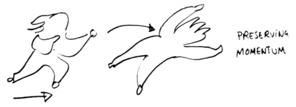
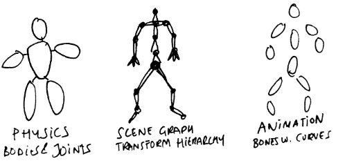

# Inheriting Velocity in Ragdolls

After a slew of abstract articles about C++ and code structuring I'd like to get back to some more meaty game engine stuff. So today I'll talk about ragdolls. In particular, how to preserve the momentum of the animated bodies, so that when you switch over to the ragdoll it continues to stumble forward in the same direction that the animation was moving, before crashing to a gruesome death.



So this is a small, but important problem. We want to somehow get the velocities of the animated objects and then apply them to the bodies in the ragdoll. The only snag is that animated objects typically don't know anything about velocities. Also, we need some way of matching up the physics bodies with the animated objects.

First, some background information. In the Bitsquid engine, physics, scene graph and animation are completely separate systems. We strongly believe in minimizing the couplings between different systems since that makes the engine easier to understand, reason about, modify, optimize and rewrite.



* The physics system simulates a number of bodies, possibly connected by joints.
* The scene graph handles local-to-world transforms for a collection of nodes in a hierarchy.
* The animation system evaluates and blends animation curves for bones.

Bones and bodies hold references (just integer indices, really) to nodes in the scene graph and this how the systems communicate. After the animation has been evaluated, the resulting local transforms are written to the bones' nodes in the scene graph.

For keyframed physics (animated hit bodies), the animation drives the physics, which means the physics' bodies will read their world transforms from the corresponding nodes in the scene graph. For ragdolled physics, the world transforms of the bodies are written to the scene graph after the simulation has completed.

For partial ragdolls (such as a non-functioning, but still attached limb) or powered ragdolls (ragdolls driven by motors to achieve animation poses) it gets a little more involved (perhaps a topic for a future post), but the basic setup is the same.

Given this setup there are two ways of calculating the animation velocities:

* We can calculate the velocities directly by differentiating the animation curves.
* We can record a node's transform at two different time steps and compute the velocity from the difference.

The first approach is doable, but not very practical. Not only do we have to differentiate all the animation curves, we must also take into account how those velocities are affected by the blend tree and local-to-world transforms. And even if we do all that, we still don't account for movements from other sources than animation, such as scripted movements, IK or interactions with the character controller.

The second option is the more reasonable one. Now all we need is a way of obtaining the transforms from two different time steps. There are a number of possible options:

* We could add an array of Matrix4x4:s to our scene graph's *last_world* where we store the last world transform of every object. So whenever we want to go to ragdoll we always have a *last_world* transform to calculate velocities from.
* We could simulate the character backwards in time when we want to go to ragdoll and obtain a *last_world* transform that way.
* We could delay the transition to ragdoll one frame, so that we have enough time to gather two world transforms for computing the velocity.

The first approach is conceptually simple, but costly. We are increasing the size of all our scene graphs by about 50 % (previously they contained *local* and *world* transforms, now they will also need *last_world*). In addition we must *memcpy(last_world, world)* before we compute new world transforms. That's a significant cost to pay all the time for something that happens very seldom (transition to ragdoll).

The second appraoch sounds a bit crazy, but some games actually already have this functionality. Servers in competetive multi-player fps games often need to rewind players in time in order to accurately determine if they were able to hit each other. Still, I find the approach to be a bit too complicated and invovled just to get a velocity.

The third aproach seems simple and cheap, but it violates one of our Bitsquid principles: *Thou Shalt Not Have Any Frame Delays*. Delaying something a frame can be a quick fix to many hairy problems, but it puts your game in a very weird transitional state where it at the same time both is and isn't (yet) something. The character isn't *really* a ragdoll yet, but it will be the next frame, whether I want to or not.

This new slightly self-contradictory state invites a host of bugs and before you know it, little logic pieces will start to seep into the code base *"do this* unless *you are in the special transition-to-ragdoll state"*. Congratulations, you have just made your codebase a lot more complicated and bug prone.

If this is not enough, consider the poor sucker who just wants to write a routine that does A, B, C and D, when A, B and C requires frame delays. Suddenly what was supposed to be simple function got turned into a state machine that needs to run for four frames to produce it result.

The simple rule that actions should take place immediately protects against such insanity.

So three options, none of them especially palpable.

I actually went with the first one, to always compute and store *last_world* in the scene graph, but with a flag so that this is only used for units that actually need it (characters that can go to ragdoll). When there is no clear winner, I always pick the simplest solution, because it is a lot easier to optimize later if the need should arise. (We could for example track *last_world* only for the nodes which have a corresponding ragdoll actor. Also we could store *last_world* as *(p,q)* instead of as a matrix.)

For completion, given the two transforms, the code for compting the velocities will look something like this:

```cpp
Vector3 p0 = translation(tm_0);
Vector3 p1 = translation(tm_1);
Vector3 velocity = (p1 - p0) / dt

Quaternion q0 = rotation(tm_0);
Quaternion q1 = rotation(tm_1);
Quaternion q = q1 * inverse(q0);
AxisAngle aa = q.decompose();
Vector3 angular_velocity = aa.axis * aa.angle / dt;
```
