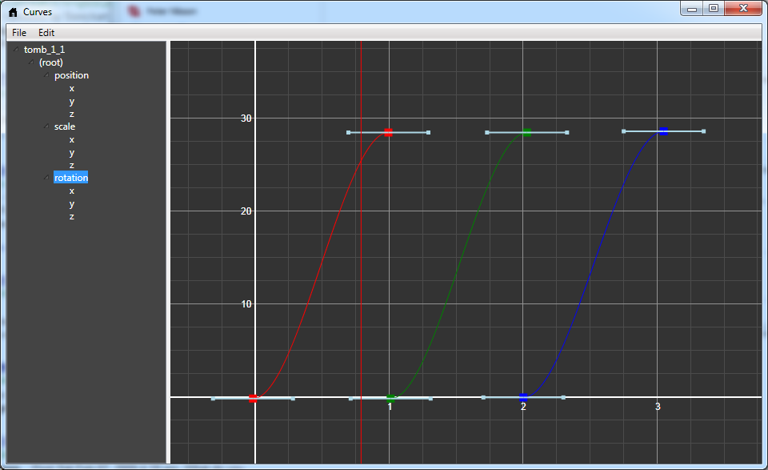

# What is gimbal lock and why do we still have to worry about it?

If you have ever worked with rotations and Euler angles you are probably at least somewhat familiar with the phrase *"gimbal lock"*. But like many things concerning rotations, angles and spaces it can be tricky to visualize and get a good grasp of.

Sometimes it feels like every time I need to think about gimbal lock I have forgotten everything about it and have to go back the beginning and ask myself: OK, but what is it *really* that is happening?

Hopefully, this article will take care of that problem.

The [Wikipedia page](http://en.wikipedia.org/wiki/Gimbal_lock) shows how gimbal lock can happen in a mechanical system. But it isn't necessarily self-evident how this translates to the computer game world. In the computer there are no mechanical limitations, we can rotate an object however we like. How can anything be "locked"?

## Euler angles

When we are using [Euler angles](http://en.wikipedia.org/wiki/Euler_angles), we represent an object's orientation as three consecutive rotations around the object's axes. We can choose the axes and the order in which we apply the rotations arbitrarily, and depending on what we choose we get different Euler representations. So XYZ is the Euler representation where the first angle rotates the object around its X-axis, the second around its (new) Y-axis and the third around its (new) Z-axis. YZX gives us a different representation. We can even have representations with repeated axes, such as XZX.

So if we want to talk about the "Euler angles" of an object, we really must also talk about what axes we are rotating around and in what order. Otherwise we have no idea at all what we are talking about. Unfortunately, many articles about Euler angles are pretty sloppy with this and throw around terms like *yaw*, *pitch* and *roll* as if they had completely well-defined and unambiguous meanings. I prefer to use more wordy, but descriptive names, such as *euler_xyz[0]* that unambiguously state the axis rotation order and the index of the angle we are talking about.

An object has three rotational degrees of freedom and it is quite easy to see that the three Euler angles for a particular axis order (XYZ) are enough to define any possible orientation of an object. Note though that the representation is not unique. There are many possible Euler angles that represent the same orientation. For example, adding 360 degrees to any of the three angles will give us a different representation that results in the same object orientation.

So "gimbal lock" doesn't mean that there are rotations that can't be expressed as Euler angles. We can express any rotation in Euler angle form. Given an object, we can convert its orientation to Euler angles, and from that orientation we can rotate the object however we like and convert the new orientation to other Euler angles.

So what exactly is it that is "locked"? It seems we can do whatever we like.

## The "lock" in gimbal lock

The term "gimbal lock" comes from the mechanical world. If the problem had originated in the world of computers, it would probably have been called something less confusing, such as "Euler angle flip" or "coordinate singularity".

Because, in the computer world, there is really nothing that gets "locked". Instead, the problem is this: when the Euler angles have particular values, there are orientations that are very similar to the current orientation which can't be achieved by just making small changes to the Euler angles. In particular, this happens when one of the angles is at 90 degrees, so that two rotation axes coincide.

So even though the orientations are "close" in the real world, they are not close in the Euler representation. In fact, at least one of the Euler angles will have to flip 180 degrees in order for us to represent the new orientation.

So one of the angles have to flip? What is the big deal? Can't we just flip it and get on with our stuff?

We can, as long as the angles only represent instantaneous "snapshots" of the object's orientation. However, if the angles represent key frames in an animation and we want to interpolate between those key frames we run into trouble. If one of the angles flips 180 degrees between two key frames and we interpolate between those values, we will see the the object animating through all those 180 degrees. In the viewport, we will see the object doing a "flip" or "roll" that shouldn't be there.

Note that it is only the interpolation that creates this unwanted behavior. If we just displayed the actual key frames and didn't interpolate between them -- everything would look right. We could work in Euler angles as much as we liked and be as close to the gimbal lock position as we wanted and no-one would ever know.

So the only thing we need to fix to get rid of gimbal lock is the interpolation. If you have done any work with 3D graphics you probably already know the answer -- to use quaternions instead of Euler angles to represent angles. Quaternions don't have the weird singularity points that Euler angles have and we can interpolate between any keyframes by just lerping the quaternions.

It doesn't matter if the animation package is using Euler angles internally, as long as we convert everything to quaternions before we do the interpolation. Note that interpolation in quaternion space is not the same as interpolation in Euler space though, so to get as close as possible to what the animator intended, we probably want to sample the animation at our target frame rate and generate our quaternion key frames from those samples, rather than directly converting the animator's key frames (which may be further apart).

Well, there is one caveat actually. If we have more than 180 degrees of rotation in a single frame we can't represent that nicely with quaternions. Quaternions always lerp the shortest path between two orientations and you can't represent several "laps" of rotation with quaternions as you can do with Euler angles (by setting one of the angles to 9000 degrees, for example). But you can fix that by sampling at a higher frame rate if you need to represent really fast rotations with quaternions.

So with that we can say good bye and good riddance to Euler angles and never have to worry about their sorry gimbal locking asses ever again.

Or so you may think...

## The return of gimbal lock

I certainly thought so, until I started working on the new cutscene animation system for our level editor.

You see, animators really like to work with *curves*. They like to see a visual representation of what the animation will do to an object over time with key points that can be moved and handles that can be adjusted to change the slope of the curve.

Curves! Animators love them!

Quaternions are great for interpolation, but they are no good for curve editing.

Sure, you could probably draw some curves that represented a quaternion (the laziest thing would be to just draw the x, y and z components of the quaternion), but those curves wouldn't *mean* anything to an animator, the way the Euler angle curves do. They wouldn't be able to *do* anything with them.

So, animators want curves with keyframe interpolation. Curves need Euler angles. But what happens when we mix Euler angles with keyframe interpolation? Presto! Our old friend the gimbal lock is back again! Haven't we missed him.

That's it. We're stuck. Gimbal lock is here to stay and the animators will just have to work around it.

And we have to add support for all the usual tricks and workarounds that animators use to get around gimbal lock, such as changing the axis order (from XYZ, to XYZ, XZX or another of the twelve possible permutations), converting to quaternion and back again, applying an "Euler filter", etc.

But who said this game engine gig should be easy?
