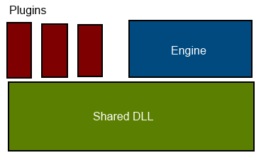

# Building an Engine Plugin System

A plugin system is a useful way to allow developers to extend the capabilities of a game engine. Of course, an engine can also be extended by directly modifying the source code, but there are several drawbacks with that approach:

* Changing the code requires you to recompile the engine. Anyone who wants to modify the engine must have the full source code, access to all the libraries and the build environment set up correctly.

* Every time you pull changes from upstream you will have to merge your changes with the incoming patches. Over time, this adds up to a significant chunk of work.

* Since you work directly in the source code, instead of against a published API, refactoring of engine systems might force you to rewrite your code from scratch.

* There is no easy way to share the modifications you have made with other people.

A plugin system solves all these issues. Plugins can be distributed as compiled DLLs. They are easily shared and you can install them by just putting them in the engine's plugin folder. Since the plugins use an explicit API, they will continue to work with new versions of the engine (unless backwards compatibility is explicitly broken).

Of course, the plugin API can never cover *everything*, so there will always be things you can do by modifying the engine that you can't do through the plugin API. Nevertheless, it is a good complement.

## A Tale of Two APIs

When building a plugin system, there are actually two APIs that you need to think about.

The first, and most obvious one, is the API that the plugin exposes to the engine: a set of exported functions that the engine will call at predefined times. For a very basic system, it could look something like this:

```cpp
__declspec(dllexport) void init();
__declspec(dllexport) void update(float dt);
__declspec(dllexport) void shutdown();
```

The *other* API, which usually is a lot more complicated, is the API that the *engine* exposes to the *plugin*.

In order to be useful, the plugin will want to call on the engine to do stuff. This can be things like spawning a unit, playing a sound, rendering some meshes, etc. The engine needs to provide some way for plugins to call on these services.

There are a number of ways of doing this. One common solution is to put all the shared functionality in a common DLL and then link both the engine application and the plugin against this DLL.



The drawback of this approach is that the more functionality that the plugins need access to, the more must go in the shared DLL. Eventually you end up with most of the engine in the shared DLL, which is pretty far from the clean and simple APIs that we strive for.

This creates a very strong coupling between the engine and the plugins. Every time we want to modify something in the engine, we will probably have to modify the shared DLL and thus likely break all of the plugins.

As anyone who has read my previous articles know I *really* don't like these kinds of strong couplings. They prevent you from rewriting and refactoring your systems and thus eventually cause your code to stagnate.

Another approach is to let the engine's scripting language (in our case Lua) work as the engine's API. With this approach, any time a plugin wanted the engine to do something it would use a Lua call.

For lots of applications I think this can be a really good solution, but in our case it doesn't seem like a perfect fit. First, the plugins will need access to a lot of stuff that is more "low level" than what you can access from Lua. And I'm not to keen on exposing all of the engine's innards to Lua. Second, since both the plugins and the engine are written in C++, marshalling all the calls between them through Lua seems both overly complicated and inefficient.

I prefer to have an interface that is minimalistic, data-oriented and C-based (because of C++ ABI compatibility issues and also because of... well...  C++).

## Interface Querying

Instead of linking the plugin against a DLL that provides the engine API. We can send the engine API to the plugin when we initialize it. Something like this (a simplified example):

*plugin_api.h:*

> ```cpp
> typedef struct EngineApi
> {
> 	void (*spawn_unit)(World *world, const char *name, float pos[3]);
> 	...
> } EngineApi;
> ```

*plugin.h*

> ```cpp
> #include "plugin_api.h"
>
> __declspec(dllexport) void init(EngineApi *api);
> __declspec(dllexport) void update(float dt);
> __declspec(dllexport) void shutdown();
> ```

This is pretty good. The plugin develeoper does not need to link against anything, just include the header file *plugin_api.h*, and then she can call the functions in the *EngineApi* struct to tell the engine to do stuff.

The only thing that is missing is versioning support.

At some point in the future we probably want to modify the *EngineApi*. Perhaps we discover that we want to add a rotation argument to *spawn_unit()* or somehting else.
We can achieve this by introducing *versioning* in the system. Instead of sending the engine API directly to the plugin, we send the plugin a function that lets it query for a specific version of the engine API.

With this approach, we can also break the API up into smaller submodules that can be queried for individually. This gives us a cleaner organization.

*plugin_api.h*

> ```cpp
> #define WORLD_API_ID    0
> #define LUA_API_ID      1
>
> typedef struct World World;
>
> typedef struct WorldApi_v0 {
> 	void (*spawn_unit)(World *world, const char *name, float pos[3]);
> 	...
> } WorldApi_v0;
>
> typedef struct WorldApi_v1 {
> 	void (*spawn_unit)(World *world, const char *name, float pos[3], float rot[4]);
> 	...
> } WorldApi_v1;
>
> typedef struct lua_State lua_State;
> typedef int (*lua_CFunction) (lua_State *L);
>
> typedef struct LuaApi_v0 {
> 	void (*add_module_function)(const char *module, const char *name, lua_CFunction f);
> 	...
> } LuaApi_v0;
>
> typedef void *(*GetApiFunction)(unsigned api, unsigned version);
> ```

When the engine instances the plugin, it passes along *get_engine_api()*, which the plugin can use to get hold of different engine APIs.

The plugin will typically set up the APIs in the *init()* function:

```cpp
static WorldApi_v1 *_world_api = nullptr;
static LuaApi_v0 *_lua_api = nullptr;

void init(GetApiFunction get_engine_api)
{
	_world_api = (WorldApi_v1 *)get_engine_api(WORLD_API, 1);
	_lua_api = (LuaApi_v0 *)get_engine_api(LUA_API, 0);
}
```

Later, the plugin case use these APIs:

```cpp
_world_api->spawn_unit(world, "player", pos);
```

If we need to make a breaking change to an API, we can just introduce a new version of that API. As long as *get_engine_api()* can still return the old API version when requested for it, all existing plugins will continue to work.

With this querying system in place for the engine, it makes sense to use the same approach for the plugin as well. I.e. instead of exposing individual functions *init()*, *update()*, etc, the plugin just exposes a single function *get_plugin_api()* which the engine can use in the same way to query APIs from the plugin.

*plugin_api.h*

> ```cpp
> #define PLUGIN_API_ID 2
>
> typedef struct PluginApi_v0
> {
> 	void (*init)(GetApiFunction get_engine_api);
> 	...
> } PluginApi_v0;
> ```

*plugin.c*

> ```cpp
> __declspec(dllexport) void *get_plugin_api(unsigned api, unsigned version);
> ```

Since we now have versioning on the plugin API as well, this means we can modify it (add new required functions, etc) without breaking existing plugins.

### Putting It All Together

Putting all this together, here is a complete (but very small) example of a plugin that exposes a new function to the Lua layer of the engine:

*plugin_api.h*

> ```cpp
> #define PLUGIN_API_ID       0
> #define LUA_API_ID          1
>
> typedef void *(*GetApiFunction)(unsigned api, unsigned version);
>
> typedef struct PluginApi_v0
> {
> 	void (*init)(GetApiFunction get_engine_api);
> } PluginApi_v0;
>
> typedef struct lua_State lua_State;
> typedef int (*lua_CFunction) (lua_State *L);
>
> typedef struct LuaApi_v0
> {
> 	void (*add_module_function)(const char *module, const char *name, lua_CFunction f);
> 	double (*to_number)(lua_State *L, int idx);
> 	void (*push_number)(lua_State *L, double number);
> } LuaApi_v0;
> ```

*plugin.c*

> ```cpp
> #include "plugin_api.h"
>
> LuaApi_v0 *_lua;
>
> static int test(lua_State *L)
> {
> 	double a = _lua->to_number(L, 1);
> 	double b = _lua->to_number(L, 2);
> 	_lua->push_number(L, a+b);
> 	return 1;
> }
>
> static void init(GetApiFunction get_engine_api)
> {
> 	_lua = get_engine_api(LUA_API_ID, 0);
>
> 	if (_lua)
> 		_lua->add_module_function("Plugin", "test", test);
> }
>
> __declspec(dllexport) void *get_plugin_api(unsigned api, unsigned version)
> {
> 	if (api == PLUGIN_API_ID && version == 0) {
> 		static PluginApi_v0 api;
> 		api.init = init;
> 		return &api;
> 	}
> 	return 0;
> }
> ```

*engine.c*

> ```cpp
> // Initialized elsewhere.
> LuaEnvironment *_env = 0;
>
> void add_module_function(const char *module, const char *name, lua_CFunction f)
> {
> 	_env->add_module_function(module, name, f);
> }
>
> void *get_engine_api(unsigned api, unsigned version)
> {
> 	if (api == LUA_API_ID && version == 0 && _env) {
> 		static LuaApi_v0 lua;
> 		lua.add_module_function = add_module_function;
> 		lua.to_number = lua_tonumber;
> 		lua.push_number = lua_pushnumber;
> 		return &lua;
> 	}
> 	return 0;
> }
>
> void load_plugin(const char *path)
> {
> 	HMODULE plugin_module = LoadLibrary(path);
> 	if (!plugin_module) return;
> 	GetApiFunction get_plugin_api = (GetApiFunction)GetProcAddress(plugin_module, "get_plugin_api");
> 	if (!get_plugin_api) return;
> 	PluginApi_v0 *plugin = (PluginApi_v0 *)get_plugin_api(PLUGIN_API_ID, 0);
> 	if (!plugin) return;
> 	plugin->init(get_engine_api);
> }
> ```
