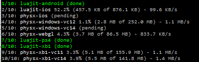

# Introducing the Stingray Package Manager (spm)

The *Stingray Package Manager*, or `spm`, is a small Ruby program that is responsible for downloading specific versions of the external artifacts (libraries, sample projects, etc) that are needed to build the Stingray engine and tools. It's a small but important piece of what makes *one-button builds* possible.

By *one-button builds* I mean that it should be possible to build Stingray with a single console command and no human intervention. It should work for any version in the code history. It should build all tools, plugins and utilities that are part of the project (as well as meaningful subsets of those for faster builds). In addition, it should work for all target platforms, build configurations (*debug*, *development*, *release*) and options (enabling/disabling Steam, Oculus, AVX, etc).

Before you have experienced *one-button builds* it's easy to think: So what? What's the big deal? I can download a few libraries manually, change some environment variables when needed, open a few Visual Studio projects and build them. Sure, it is a little bit of work every now and then, but not too bad.

In fact, there are big advantages to having a one-button build system in place:

* New developers and anyone else interested in the code can dive right in and don't have to spend days trying to figure out how to compile the damned thing.

* Build farms don't need as much baby sitting (of course build farms always need *some* baby sitting).

* All developers build the engine in the same way, the results are repeatable and you don't get bugs from people building against the wrong libraries.

* There is a known way to build any previous version of the engine, so you can fix bugs in old releases, do bisect tests to locate bad commits, etc.

But more than these specific things, having one-button builds also gives you *one less thing to worry about*. As programmers we are always trying to fit too much stuff into our brains. We should just come to terms with the fact that as a species, we're really not smart enough to be doing this. That is why I think that simplicity is the most important virtue of programming. Any way we can find to reduce cognitive load and context switching will allow us to focus more on the problem at hand.

In addition to `spm` there are two other important parts of our one-button build system:

* The `cmake` configuration files for building the various targets.

* A front-end ruby script (`make.rb`) that parses command-line parameters specifying which configuration to build and makes the appropriate calls to `spm` and `cmake`.

But let's get back to `spm`. As I said at the top, the responsibility of `spm` is to download and install external artifacts that are needed by the build process. There are some things that are important:

* Exact versions of these artifacts should be specified so that building a specific version of the source (git hash) will always use the same exact artifacts and yield a predictable result.

* Since some of these libraries are big, hundreds of megabytes, even when zipped (computers are a sadness), it is important not to download more than absolutely necessary for making the current build.

* For the same reason we also need control over how we cache older versions of the artifacts. We don't want to evict them immediately, because then we have to download hundreds of megabytes every time we switch branch. But we don't want to keep all old versions either, because then we would pretty soon run out of space on small disks.

The last two points are the reason why something like `git-lfs` doesn't solve this problem out-of-the box and some more sophisticated package management is needed.

`spm` takes inspiration from popular package managers like `npm` and `gem` and offers a similar set of sub commands. `spm install` to install a package. `spm uninstall` to uninstall, etc. At it's heart, what `spm` does is a pretty simple operation:


Upon request, `spm` downloads a specific artifact version (identified by a hash) from an artifact repository. We support multiple artifact repositories, such as S3, git and Artifactory. The artifact is unzipped and stored in a local library folder where it can be accessed by the build scripts. As specific artifact versions are activated and deactivated we move them in and out of the local artifact cache.

We don't use unique folder names for artifact versions. So the folder name of an artifact (e.g., `luajit-2.1.0-windows`) doesn't tell us the exact version (`y0dqqY640edvzOKu.QEE4Fjcwxc8FmlM`). `spm` keeps track of that in internal data structures.

There are advantages and disadvantages to this approach:

* We don't have to change the build scripts when we do minor fixes to a library, only the version hash used by `spm`.
* We avoid ugly looking hashes in the folder names and don't have to invent our own version numbering scheme, in addition to the official one.
* We can't see at a glance which specific library versions are installed without asking `spm`.
* We can't have two versions of the same library installed simultaneously, since their names could collide, so we can't run parallel builds that use different library versions.
* If library version names were unique we wouldn't even need the cache folder, we could just keep all the versions in the library folder.

I'm not 100 % sure we have made the right choice, it might be better to enforce unique names. But it is not a huge deal so unless there is a big impetus for change we will stay on the current track.

`spm` knows which versions of the artifacts to install by reading configuration files that are checked in as part of the source code. These configuration files are simple JSON files with entries like this:

```json
cmake = {
	groups = ["cmake", "common"]
	platforms = ["win64", "win32", "osx", "ios", "android", "ps4", "xb1", "webgl"]
	lib = "cmake-3.4.0-r1"
	version = "CZRgSJOqdzqVXey1IXLcswEuUkDtmwvd"
	source =  {
		type = "s3"
		bucket = "..."
		access-key-id = "..."
		secret-access-key = "..."
	}
}
```

This specifies the name of the packet (`cmake`), the folder name to use for the install (`cmake-3.4.0-r1`), the version hash and how to retrieve it from the artifact repository (these source parameters can be re-used between different libraries).

To update a library, you simply upload the new version to the repository, modify the version hash and check in the updated configuration file.

The `platforms` parameter specifies which platforms this library is used on and `groups` is used to group packages together in meaningful ways that make `spm` easier to use. For example, there is an `engine` group that contains all the packages needed to build the engine runtime and a corresponding `editor` group for building the editor.

So if you want to install all libraries needed to build the engine on Xbox One, you would do:

```
spm install-group -p xb1 engine
```

This will install only the libraries needed to build the engine for Xbox One and nothing else. For each library, `spm` will:

* If the library is already installed -- do nothing.
* If the library is in the cache -- move it to the library folder.
* Otherwise -- download it from the repository.

Downloads are done in parallel, for maximum speed, with a nice command-line based progress report:



The cache is a simple MRU cache that can be pruned either by time (throw away anything I haven't used in a month) or by size (trim the cache down to 10 GB, keeping only the most recently used stuff).

Of course, you usually never have even have to worry about calling `spm` directly, because `make.rb` will automatically call it for you with the right arguments, based on the build parameters you have specified to `make.rb`. It all happens behind the scene.

Even the `cmake` binary itself is installed by the `spm` system, so the build is able to bootstrap itself to some extent. Unfortunately, the bootstrap process is not 100 % complete -- there are still some things that you need to do manually before you can start using the one-button builds:

* Install Ruby (for running `spm.rb` and `make.rb`).
* Specify the location of your library folder (with an `SR_LIB_DIR` environment variable).
* Install a suitable version of Visual Studio and/or XCode.
* Install the platform specific SDKs and toolchains for the platforms you want to target.

I would like to get rid of all of this and have a zero-configuration bootstrap procedure. You sync the repository, give one command and bam -- you have everything you need.

But some of these things are a bit tricky. Without Ruby we need something else for the initial step that at least is capable of downloading and installing Ruby. We can't put restricted software in public repositories and it might be considered hostile to automatically run installers on the users' behalf. Also, some platform SDKs need to be installed globally and don't offer any way of switching quickly between different SDK versions, thwarting any attempt to support quick branch switching.

But we will continue to whittle away at these issues, taking the simplifications where we can find them.