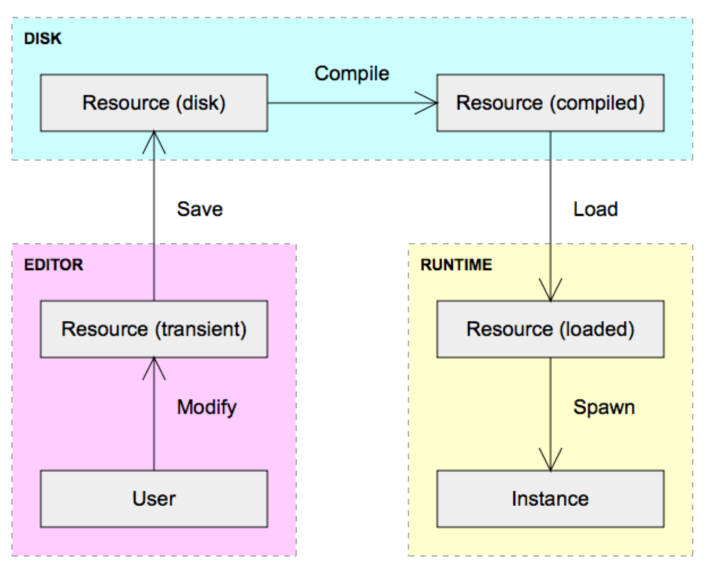

# Hot Reloadable JavaScript, Batman!

JavaScript is my new favorite prototyping language. Not because the language itself is fantastic. I mean, it's not too bad. It actually has a lot of similarity to Lua, but its hidden under a heavy layer of [WAT!?](https://www.destroyallsoftware.com/talks/wat), like:

* Browser incompatibilities!?
* Semi-colons are optional, but you "should" put them there anyway!?
* Propagation of `null`, `undefined` and `NaN` until they cause an error very far from where they originated!?
* Weird type conversions!? `"0" == false`!?
* Every function is also an object constructor!? `x = new add(5,7)`!?
* Every function is also a method!?
* You must check everything with `hasOwnProperty()` when iterating over objects!?

But since Lua is a work of genius and beauty, being a half-assed version of Lua is still pretty good. You could do worse, as languages go.

And JavaScript is actually getting better. Browser compatibility is improving, automatic updates is a big factor in this. And if your goal is just to prototype and play, as opposed to building robust web applications, you can just pick your favorite browser, go with that and don't worry about compatibility. The ES6 standard also adds a lot of nice little improvements, like `let`, `const`, `class`, lexically scoped `this` (for arrow functions), etc.

But more than the language, the nice thing about JavaScript is that comes with a lot of the things you need to do interesting stuff -- a user interface, 2D and 3D drawing, a debugger, a console REPL, etc. And it's ubiquitous -- everybody has a web browser. If you do something interesting and want to show it to someone else, it is as easy as sending a link.

OK, so it doesn't have file system access (unless you run it through [node.js](https://nodejs.org/en/)), but who cares? What's so fun about reading and writing files anyway? The 60's called, they want their programming textbooks back!

I mean in JavaScript I can quickly whip up a little demo scene, add some UI controls and then share it with a friend. That's more exciting. I'm sure someone will tell me that I can do that in Ruby too. I'm sure I could, if I found the right gems to install, picked what UI library I wanted to use and learned how to use that, found some suitable bundling tools that could package it up in an executable, preferably cross-platform. But I would probably run into some annoying and confusing error along the way and just give up.

With increasing age I have less and less patience for the *sysadmin* part of programming. Installing libraries. Making sure that the versions work together. Converting a `configure.sh` script to something that works with our build system. Solving `PATH` conflicts between multiple installed `cygwin` and `mingw` based toolchains. Learning the intricacies of some weird framework that will be gone in 18 months anyway. There is enough of that stuff that I *have to* deal with, just to do my job. I don't need any more. When I can avoid it, I do.

One thing I've noticed since I started to prototype in JavaScript is that since drawing and UI work is so simple to do, I've started to use programming for things that I previously would have done in other ways. For example, I no longer do graphs like this in a drawing program:



Instead I write a little piece of JavaScript code that draws the graph on an HTML canvas (code here: [pipeline.js](https://jsbin.com/xurego/edit?js,output)).

JavaScript canvas drawing cannot only replace traditional drawing programs, but also Visio (for process diagrams), Excel (graphs and charts), Photoshop and [Graphviz](http://graphviz.org). And it can do more advanced forms of visualization and styling, that are not possible in any of these programs.

For simple graphs, you could ask if this really saves any time in the long run, as compared to using a regular drawing program. My answer is: I don't know and I don't care. I think it is more important to do something interesting and fun with time than to save it. And for me, using drawing programs stopped being fun some time around when [ClarisWorks](https://en.wikipedia.org/wiki/AppleWorks) was discontinued. If you ask me, so called "productivity software" has just become less and less productive since then. These days, I can't open a Word document without feeling my pulse racing. You can't even print the damned things without clicking through a security warning. Software PTSD. Programmers, we should be ashamed of ourselves. Thank god for [Markdown](https://daringfireball.net/projects/markdown/).

Another thing I've stopped using is slide show software. That was never any fun either. Keynote was at least tolerable, which is more than you can say about Powerpoint. Now I just use [Remark.js](http://remarkjs.com/#1) instead and write my slides directly in HTML. I'm much happier and I've lost 10 pounds! Thank you, JavaScript!

But I think for my next slide deck, I'll write it directly in JavaScript instead of using Remark. That's more fun! Frameworks? I don't need no stinking frameworks! Then I can also finally solve the issue of auto-adapting between 16:9 and 4:3 so I don't have to letterbox my entire presentation when someone wants me to run it on a 1995 projector. Seriously, people!


*This is not the connector you are looking for!*

And I can put HTML 5 videos directly in my presentation, so I don't have to shut down my slide deck to open a video in a separate program. Have you noticed that this is something that almost every speaker does at big conferences? Because apparently they haven't succeeded in getting their million dollar *presentation* software to reliably *present* a video file! Software! Everything is broken!

Anyhoo... to get back off topic, one thing that surprised me a bit about JavaScript is that there doesn't seem to be a lot of interest in hot-reloading workflows. Online there is [JSBin](https://jsbin.com/?html,output), which is great, but not really practical for writing bigger things. If you start googling for something you can use offline, with your own favorite text editor, you don't find that much. This is a bit surprising, since JavaScript is a dynamic language -- hot reloading should be a hot topic.

There are some node modules that can do this, like [budo](https://www.npmjs.com/package/budo). But I'd like something that is small and hackable, that works instantly and doesn't require installing a bunch of frameworks. By now, you know how I feel about that.

After some experimentation I found that adding a script node dynamically to the DOM will cause the script to be evaluated. What is a bit surprising is that you can remove the script node immediately afterwards and everything will still work. The code will still run and update the JavaScript environment. Again, since this is only for my personal use I've not tested it on Internet Explorer 3.0, only on the browsers I play with on a daily basis, Safari and [Chrome Canary](https://www.google.com/chrome/browser/canary.html).

What this means is that we can write a `require` function for JavaScript like this:

```js
function require(s)
{
	var script = document.createElement("script");
	script.src = s + "?" + performance.now();
	script.type = "text/javascript";
	var head = document.getElementsByTagName("head")[0];
	head.appendChild(script);
	head.removeChild(script);
}
```

We can use this to load script files, which is kind of nice. It means we don't need a lot of `<script>` tags in the HTML file. We can just put one there for our main script, `index.js`, and then require in the other scripts we need from there.

Also note the deftly use of `+ "?" + performance.now()` to prevent the browser from caching the script files. That becomes important when we want to reload them.

Since for dynamic languuages, reloading a script is the same thing as running it, we can get automatic reloads by just calling `require` on our own script from a timer:

```javascript
function reload()
{
	require("index.js");
	render();
}

if (!window.has_reload) {
	window.has_reload = true;
	window.setInterval(reload, 250);
}
```

This reloads the script every 250 ms.

I use the `has_reload` flag on the window to ensure that I set the reload timer only the first time the file is run. Otherwise we would create more and more reload timers with every reload which in turn would cause even more reloads. If I had enough power in my laptop the resulting chain reaction would vaporize the universe in under three minutes. Sadly, since I don't all that will happen is that my fans will spin up a bit. Damnit, I need more power!

After each `reload()` I call my `render()` function to recreate the DOM, redraw the canvas, etc with the new code. That function might look something like this:

```js
function render()
{
    var body = document.getElementsByTagName("body")[0];
    while (body.hasChildNodes()) {
        body.removeChild(body.lastChild);
    }

    var canvas = document.createElement("canvas");
    canvas.width = 650;
    canvas.height = 530;
    var ctx = canvas.getContext("2d");
    drawGraph(ctx);
    body.appendChild(canvas);
}
```

Note that I start by removing all the DOM elements under `<body>`. Otherwise each reload would create more and more content. That's still linear growth, so it is better than the exponential chain reaction you can get from the reload timer. But linear growth of the DOM is still pretty bad.

You might think that reloading all the scripts and redrawing the DOM every 250 ms would create a horrible flickering display. But so far, for my little play projects, everything works smoothly in both Safari and Chrome. Glad to see that they are double buffering properly.

If you do run into problems with flickering you could try using the [Virtual DOM](http://tonyfreed.com/blog/what_is_virtual_dom) method that is so popular with JavaScript UI frameworks these days. But try it without that first and see if you really need it, because ugh frameworks, amirite?

Obviously it would be better to reload only when the files actually change and not every 250 ms. But to do that you would need to do something like adding a file system watcher connected to a web socket that could send a message when a reload was needed. Things would start to get complicated, and I like it simple. So far, this works well enough for my purposes.

As a middle ground you could have a small bootstrap script for doing the reload:

```js
window.version = 23;
if (window.version != window.last_version) {
	window.last_version = window.version;
	reload();
}
```

You would reload this small bootstrap script every 250 ms. But it would only trigger a reload of the other scripts and a re-render when you change the version number. This avoids the reload spamming, but it also removes the immediate feedback loop -- change something and see the effect immediately which I think is [really important](https://vimeo.com/36579366).

As always with script reloads, you must be a bit careful with how you write your scripts to ensure thy work nicely with the reload feature. For example, if you write:

```js
class Rect
{
	...
};
```

It works well in Safari, but Chrome Canary complains on the second reload that you are redefining a class. You can get around that by instead writing:

```js
var Rect = class {
```

Now Chrome doesn't complain anymore, because obviously you are allowed to change the content of a variable.

To preserve state across reloads, I just put the all the state in a global variable on the window:

```js
window.state = window.state || {}
```

The first time this is run, we get an empty state object, but on future reloads we keep the old state. The `render()` function uses the state to determine what to draw. For example, for a slide deck I would put the current slide number in the `state`, so that we stay on the same page after a reload.

Here is a GIF of the hot reloading in action. Note that the browser view changes as soon as I save the file in Atom:


(No psychoactive substances where consumed during the production of this blog post. Except caffeine. Maybe I should stop drinking coffee?)